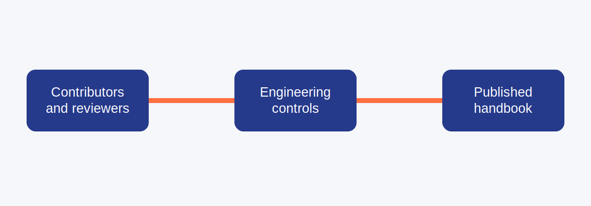
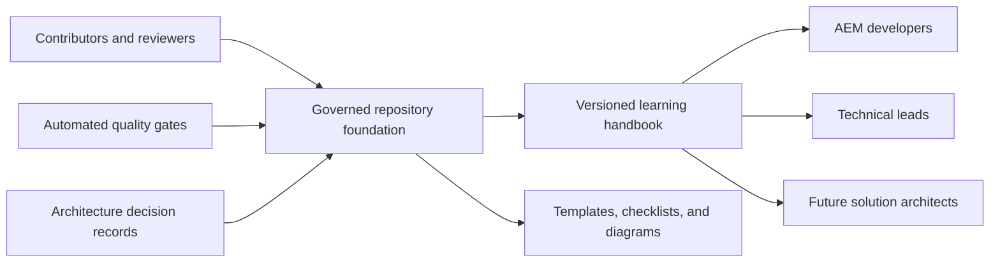

# AEM Technical Lead Playbook

[](https://srma4tech.github.io/aem-technical-lead-playbook/)
[](https://github.com/srma4tech/aem-technical-lead-playbook/actions/workflows/deploy-pages.yml)
[](https://github.com/srma4tech/aem-technical-lead-playbook/actions)
[](RELEASES.md)
[](LICENSE)

An open-source, documentation-first handbook for Adobe Experience Manager, enterprise Java, system design, production engineering, and technical leadership.

> [!NOTE]
> This handbook is under active, incremental development. Its platform, governance, navigation, reusable assets, and quality gates are established, and reviewed learning content is released in focused parts.

## Project Vision

Build a durable community reference that helps engineers progress from AEM development to accountable technical leadership and solution architecture.

## Engineering Philosophy

This handbook starts with engineering judgment before product or language detail. Technology-specific guidance is useful only when engineers can frame outcomes, reason about systems, evaluate trade-offs, protect users, own production behavior, and improve decisions with evidence.

The [Engineering Principles](docs/00-engineering-principles/README.md) section defines the shared standards that every future chapter will apply:

- Connect technical work to customer and business outcomes.
- Prefer simple, maintainable systems over speculative flexibility.
- Make decisions, assumptions, trade-offs, and ownership explicit.
- Build security, performance, reliability, observability, and documentation into delivery.
- Use production evidence, review, and incident learning for continuous improvement.
- Scale engineering capability through communication, mentorship, and durable mechanisms.

These principles are not substitutes for context. They provide a consistent way to ask better questions when constraints conflict and no procedure supplies the answer.

## Architecture Overview





## Quick Navigation

| Destination                                                                         | Purpose                                 |
| ----------------------------------------------------------------------------------- | --------------------------------------- |
| [Published documentation](https://srma4tech.github.io/aem-technical-lead-playbook/) | Search and browse the handbook          |
| [Engineering principles](docs/00-engineering-principles/README.md)                  | Establish shared engineering judgment   |
| [Learning path](LEARNING_PATH.md)                                                   | Follow role-based progression           |
| [Roadmap](ROADMAP.md)                                                               | Review milestones and journeys          |
| [Architecture decisions](docs/architecture/README.md)                               | Understand repository decisions         |
| [First contribution](FIRST_CONTRIBUTION.md)                                         | Make a first pull request               |
| [Contribution guide](CONTRIBUTING.md)                                               | Apply contribution and review standards |
| [Governance](GOVERNANCE.md)                                                         | Understand roles and decisions          |
| [Discussions](DISCUSSIONS.md)                                                       | Participate in community conversations  |

## Who Should Use This Repository

- AEM developers building strong platform fundamentals
- Senior developers expanding design and production ownership
- Technical leads guiding systems, delivery, and engineering teams
- Future solution architects developing enterprise-level judgment

## Learning Path

The progression starts with engineering judgment and [Understanding AEM Internals](docs/20-understanding-aem-internals/README.md), then continues through AEM core, delivery infrastructure, performance, security, cloud operations, enterprise Java, system design, production support, and technical leadership.

See the [learning path](LEARNING_PATH.md) and the visual journeys in the [roadmap](ROADMAP.md).

## Repository Structure

| Path                              | Responsibility                                                        |
| --------------------------------- | --------------------------------------------------------------------- |
| `docs/`                           | Published handbook, ADRs, and contributor-facing documentation checks |
| `docs/00-engineering-principles/` | Technology-agnostic engineering standards and philosophy              |
| `docs/12-checklists/`             | Future learning content about engineering checklists                  |
| `checklists/`                     | Reusable engineering review and delivery controls                     |
| `diagrams/`                       | Version-controlled diagram sources and assets                         |
| `templates/`                      | Enterprise design, decision, incident, and meeting templates          |
| `overrides/`                      | MkDocs metadata and theme extensions                                  |
| `.github/`                        | Community forms, ownership, labels, dependencies, and automation      |

## Technology Stack

| Capability    | Technology                       |
| ------------- | -------------------------------- |
| Authoring     | Markdown                         |
| Documentation | Material for MkDocs              |
| Hosting       | GitHub Pages                     |
| Diagrams      | Mermaid                          |
| Search        | MkDocs search                    |
| Formatting    | Prettier                         |
| Quality       | markdownlint, cspell, and Lychee |
| Automation    | GitHub Actions                   |
| Versioning    | Semantic Versioning              |

## Latest Release

The current release is **v0.3.0 — Understanding AEM Internals**. See [RELEASES.md](RELEASES.md) for the release policy and version roadmap, and [CHANGELOG.md](CHANGELOG.md) for notable changes.

## Contributing

Start with [FIRST_CONTRIBUTION.md](FIRST_CONTRIBUTION.md), then follow [CONTRIBUTING.md](CONTRIBUTING.md) and [STYLE_GUIDE.md](STYLE_GUIDE.md). Substantial or difficult-to-reverse platform decisions should include an ADR.

## Roadmap

The roadmap progresses from repository foundation through AEM engineering, enterprise practice, technical leadership, interview preparation, and a stable public release. See [ROADMAP.md](ROADMAP.md).

## Community

Community participation is governed by [GOVERNANCE.md](GOVERNANCE.md) and the [Code of Conduct](CODE_OF_CONDUCT.md). Use [Discussions](DISCUSSIONS.md) for open-ended ideas, issues for actionable work, and the private process in [SECURITY.md](SECURITY.md) for vulnerabilities.

## Local Preview

```bash
pip install -r requirements-docs.txt
mkdocs serve
npm install
npm run check
```

## License

Released under the [MIT License](LICENSE).
