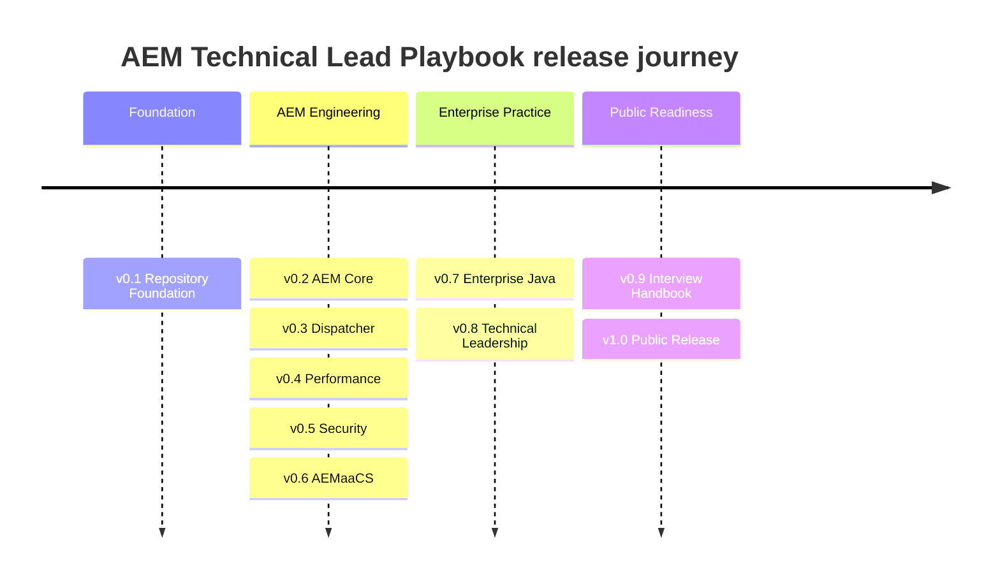
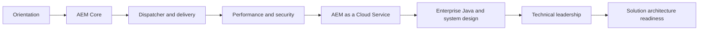
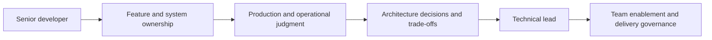
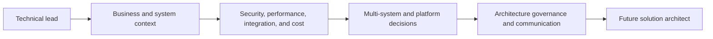

# Roadmap

## Overview

The roadmap connects repository maturity, handbook milestones, and role-based learning journeys. Delivery is milestone-driven; scope and quality determine release timing.

## Timeline

## Milestones

| Version | Milestone             | Status   |
| ------- | --------------------- | -------- |
| v0.1    | Repository Foundation | Complete |
| v0.2    | AEM Core              | Planned  |
| v0.3    | Dispatcher            | Planned  |
| v0.4    | Performance           | Planned  |
| v0.5    | Security              | Planned  |
| v0.6    | AEMaaCS               | Planned  |
| v0.7    | Enterprise Java       | Planned  |
| v0.8    | Technical Leadership  | Planned  |
| v0.9    | Interview Handbook    | Planned  |
| v1.0    | Public Release        | Planned  |

Release semantics and acceptance flow are defined in [RELEASES.md](RELEASES.md).

## Learning Progression

## Technical Lead Journey

## Future Architect Journey

## Phase 1 — Foundation

- [x] Repository architecture and governance
- [x] MkDocs platform, navigation, metadata, and quality gates
- [x] Contribution templates, labels, project workflow, and release strategy
- [x] Placeholder learning, checklist, diagram, template, and ADR structures

## Phase 2 — Core Learning Paths

- [x] Understanding AEM Internals handbook
- [ ] Editorial review model and authoritative source policy
- [ ] Introduction, learning roadmap, and AEM core content
- [ ] Dispatcher, security, and performance foundations

## Phase 3 — Enterprise Practice

- [ ] AEM as a Cloud Service and enterprise Java
- [ ] Design patterns, system design, and production support

## Phase 4 — Leadership and Public Readiness

- [ ] Technical-leadership practices and reviewed case studies
- [ ] Interview handbook and reference material
- [ ] Versioned v1.0 release and community maintainer program

## Proposal Process

Open a feature request for roadmap changes. Proposals must state audience value, dependencies, reviewers, maintenance cost, target release, and measurable completion criteria.
