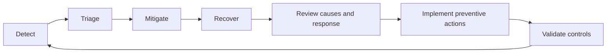

# Production Ownership

## Why this Principle Exists

A system creates value only while it works for users. Separating implementation from operational consequences hides risk, slows recovery, and allows recurring failure. Production ownership connects design choices to customer impact.

## Philosophy

The team that builds a capability remains responsible for making it observable, supportable, recoverable, and improvable. Ownership is not permanent individual on-call load; it is a team system of clear service boundaries, useful telemetry, safe operations, and shared learning.

## Core Ideas

- **You build it, you own it:** Include production behavior in design and definition of done.
- **Monitor outcomes:** Observe user-visible and business outcomes, not only resource activity.
- **Log for decisions:** Record structured, contextual events that support diagnosis without exposing sensitive data.
- **Alert on action:** Page only when timely human action is required and a response path exists.
- **Maintain runbooks:** Document verified steps, escalation, safety conditions, and recovery validation.
- **Manage incidents:** Use explicit command, communication, mitigation, and recovery roles.
- **Learn from failure:** Perform blameless analysis of causes and system conditions, then track preventive actions.
- **Prioritize customer impact:** Use affected users, duration, data risk, and business consequence to guide response.

## Engineering Mindset

Design the operational model with the feature. Ask how failure will be detected, who can act, what information they will have, how the change can be stopped, and how recovery will be verified. Optimize for controlled failure and rapid learning, not the claim that failure is impossible.

## Real World Examples

1. **Noisy alert:** Replace a threshold that pages on harmless activity with an alert tied to user impact and a documented operator action.
2. **Failed deployment:** Use a pre-defined rollback or feature-control path, validate recovery through service outcomes, and preserve evidence for analysis.
3. **Recurring incident:** Do not close the work at service restoration; assign corrective actions for detection, containment, test coverage, and operating guidance.

## Common Mistakes

- Treating an operations team as the owner of behavior only the delivery team understands.
- Counting logs and dashboards as observability without testing diagnostic questions.
- Creating alerts with no owner, urgency, runbook, or safe action.
- Writing a post-incident document but not funding or tracking preventive work.

## Trade-offs

| Tension                    | Practical position                                                                     |
| -------------------------- | -------------------------------------------------------------------------------------- |
| Signal coverage vs noise   | Collect enough context for diagnosis; alert only on actionable conditions.             |
| Recovery speed vs evidence | Mitigate customer impact first while preserving safe, lightweight evidence collection. |
| Reliability vs cost        | Set explicit service objectives and invest according to business impact.               |

## Technical Lead Perspective

The technical lead ensures operability is reviewed before release, ownership survives team changes, and incident learning affects priorities. They examine alert quality, recovery readiness, on-call sustainability, runbook validity, and closure of corrective actions.

## Questions to Ask Yourself

- How will we know users are affected before they tell us?
- Who owns the response, and what safe actions can they take?
- Can we stop, degrade, or roll back this capability?
- Which system change will prevent or limit recurrence?

## Checklist

- [ ] Service outcomes, indicators, and ownership are defined.
- [ ] Logs, metrics, and traces answer expected diagnostic questions.
- [ ] Alerts are actionable and linked to tested runbooks.
- [ ] Deployment, rollback, degradation, and recovery are exercised.
- [ ] Incident actions have owners, deadlines, and verification.

## References

- [Google SRE — Monitoring Distributed Systems](https://sre.google/sre-book/monitoring-distributed-systems/)
- [Google SRE — Postmortem Culture](https://sre.google/sre-book/postmortem-culture/)
- [AWS — Implement Application Telemetry](https://docs.aws.amazon.com/wellarchitected/latest/operational-excellence-pillar/ops_observability_application_telemetry.html)

## Related Principles

- [Debugging Mindset](11-debugging-mindset.md)
- [Performance Thinking](09-performance-thinking.md)
- [Security First](10-security-first.md)
- [Architecture Decision Records](../architecture/README.md)
- [Architecture decision template](../../templates/architecture-decision-record.md)
- [Architecture review checklist](../../checklists/architecture-review.md)
- [Repository roadmap](../../ROADMAP.md)

## Future Reading

- Service-level objectives, error budgets, and operational readiness reviews.
- Incident command, resilient delivery, and disaster recovery exercises.
