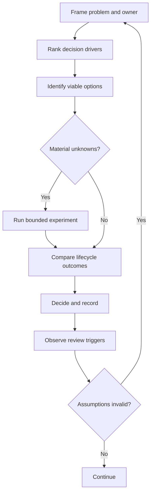

# Decision Making

## Why this Principle Exists

Engineering work is a sequence of choices made with incomplete information. Unstructured decisions become preference contests, hide risk, and are difficult to revisit. A consistent method improves speed, traceability, and outcome quality.

## Philosophy

A sound decision is not one that later proves perfect. It is one that used the available evidence responsibly, made assumptions and trade-offs explicit, assigned ownership, and defined when to review or reverse course.

## Core Ideas

- **Frame the decision:** State the problem, decision owner, deadline, affected parties, and what is out of scope.
- **Define drivers:** Rank business value, cost, security, reliability, performance, time, skills, and maintainability.
- **Compare viable options:** Use the same criteria and include the cost of migration, operation, and exit.
- **Reduce uncertainty:** Run bounded experiments only for unknowns that could change the choice.
- **Prefer reversibility:** Choose smaller, staged commitments when evidence is weak.
- **Record consequences:** Capture the rationale, alternatives, dissent, owner, and review trigger in an ADR when appropriate.

## Engineering Mindset

Separate facts, assumptions, preferences, constraints, and decisions. Decide at the last responsible moment—not the last possible moment—when waiting will produce material evidence. Stop analysis when further information is unlikely to change the ranking.

## Real World Examples

1. **Reuse versus rewrite:** Compare defect and change history, migration risk, ownership, and opportunity cost rather than the age of the existing system.
2. **Configuration versus code:** Use configuration for expected bounded variation; use code when behavior requires testing, composition, and explicit lifecycle.
3. **Framework versus custom implementation:** Count ecosystem maturity, constraints, upgrade path, operational burden, exit cost, and team competence.

## Common Mistakes

- Listing options without ranking the criteria that distinguish them.
- Using a proof of concept to validate only the preferred option.
- Treating sunk cost as future value or a rewrite as automatic debt removal.
- Recording the decision but not its assumptions, consequences, or review trigger.

## Trade-offs

| Tension                   | Practical position                                                                                                     |
| ------------------------- | ---------------------------------------------------------------------------------------------------------------------- |
| Cost vs value             | Compare total lifecycle cost with measurable outcome, risk reduction, and time-to-value.                               |
| Performance vs complexity | Buy complexity only against a measured requirement and include operational cost.                                       |
| Reuse vs independence     | Reuse stable capabilities when shared ownership and coupling are acceptable; duplicate when autonomy has higher value. |

## Technical Lead Perspective

The lead protects the quality of the decision process without owning every decision. They identify affected stakeholders, expose unspoken constraints, calibrate evidence to reversibility, prevent analysis paralysis, and ensure consequential decisions remain discoverable.

## Questions to Ask Yourself

- What exactly must be decided, by whom, and by when?
- Which driver would change the preferred option if its weight changed?
- What evidence is missing, and can it be obtained at proportionate cost?
- What event should trigger review or reversal?

## Checklist

- [ ] Decision scope, owner, deadline, and stakeholders are named.
- [ ] Drivers and constraints are ranked.
- [ ] Options are compared using lifecycle evidence.
- [ ] Unknowns are reduced through bounded discovery.
- [ ] Decision, consequences, and review triggers are recorded.

## References

- [Azure Well-Architected — Reliability Trade-offs](https://learn.microsoft.com/en-us/azure/well-architected/reliability/tradeoffs)
- [Azure Well-Architected Framework](https://learn.microsoft.com/en-us/azure/well-architected/what-is-well-architected-framework)
- [AWS — Operational Readiness Review Mechanisms](https://docs.aws.amazon.com/wellarchitected/latest/operational-readiness-reviews/building-mechanisms.html)

## Related Principles

- [Engineering Mindset](01-engineering-mindset.md)
- [Technical Lead Principles](02-technical-lead-principles.md)
- [Documentation Culture](07-documentation-culture.md)
- [Architecture Decision Records](../architecture/README.md)
- [Architecture decision template](https://github.com/srma4tech/aem-technical-lead-playbook/blob/main/templates/architecture-decision-record.md)
- [Architecture review checklist](https://github.com/srma4tech/aem-technical-lead-playbook/blob/main/checklists/architecture-review.md)
- [Repository roadmap](https://github.com/srma4tech/aem-technical-lead-playbook/blob/main/ROADMAP.md)

## Future Reading

- Architecture Decision Record facilitation and review.
- Cost modeling, option value, and evolutionary architecture.
