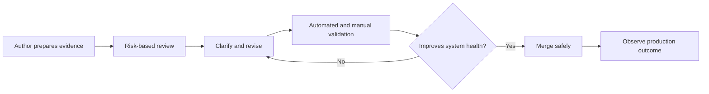

# Code Review Philosophy

## Why this Principle Exists

Every accepted change alters the future cost and risk of a system. Code review provides an independent engineering judgment before that change becomes shared responsibility.

## Philosophy

Review exists to improve correctness and long-term code health while allowing responsible progress. It is neither a style contest nor a transfer of accountability from author to reviewer. The author provides evidence; the reviewer tests the change against behavior, risk, and maintainability.

## Core Ideas

- **Correctness:** Verify that behavior matches the requirement, including boundaries and failure paths.
- **Maintainability:** Examine clarity, cohesion, dependencies, tests, documentation, and ease of future change.
- **Security:** Challenge trust boundaries, privilege, input handling, sensitive data, dependencies, and failure defaults.
- **Performance:** Look for changed access patterns, resource bounds, contention, and evidence for performance claims.
- **Scalability:** Consider growth dimensions, limits, coordination, state, and failure amplification.
- **Readability:** Require intent and constraints to be understandable in the code and durable documentation.
- **Future maintenance:** Ask who owns the behavior, how it is operated, and what migration or rollback will require.

## Engineering Mindset

Review the change, not the author. Calibrate depth to risk and reversibility. Separate blocking concerns from suggestions and explain the reason behind each important comment. Prefer a smaller reviewable change over attempting to reason about an unnecessarily broad diff.

## Real World Examples

1. **Large refactor with feature change:** Request separation so behavior and structural movement can be validated independently.
2. **Performance claim:** Ask for the baseline, workload, target, benchmark method, and resource trade-off rather than accepting intuition.
3. **Non-blocking polish:** Label it clearly as optional and avoid delaying a change that improves overall code health.

## Common Mistakes

- Reviewing formatting while missing behavior, data, security, or operational risk.
- Demanding personal preferences that are not supported by standards or material outcomes.
- Leaving ambiguous comments that do not identify impact or required action.
- Approving because automated checks pass, or blocking until the change is subjectively perfect.

## Trade-offs

| Tension                          | Practical position                                                                                        |
| -------------------------------- | --------------------------------------------------------------------------------------------------------- |
| Thoroughness vs flow             | Increase depth with blast radius; keep changes small and route specialist concerns to suitable reviewers. |
| Consistency vs local improvement | Preserve conventions unless the change deliberately improves code health and migration is controlled.     |
| Teaching vs delivery             | Explain reasoning and offer follow-up learning without turning every review into a redesign exercise.     |

## Technical Lead Perspective

The lead designs a healthy review system: clear ownership, response expectations, specialist routes, comment severity, escalation, and metrics that reveal waiting or rework. They resolve deadlock through shared drivers and ensure reviewers do not become a scarce approval queue.

## Questions to Ask Yourself

- What user, data, security, or operational behavior can this change affect?
- Which claim lacks evidence or a test?
- Is this comment blocking, optional, or informational, and is that clear?
- Does the change improve the overall health of the codebase?

## Checklist

- [ ] Purpose, scope, risk, validation, and rollout are explained.
- [ ] Correctness and failure behavior are covered by suitable tests.
- [ ] Security, performance, scalability, and operability are considered.
- [ ] Names, structure, documentation, and ownership support future maintenance.
- [ ] Review comments are specific, respectful, and severity-labeled.

## References

- [Google — The Standard of Code Review](https://google.github.io/eng-practices/review/reviewer/standard.html)
- [Google — What to Look for in a Code Review](https://google.github.io/eng-practices/review/reviewer/looking-for.html)
- [Google — Writing Review Comments](https://google.github.io/eng-practices/review/reviewer/comments.html)

## Related Principles

- [Clean Code](03-clean-code.md)
- [Security First](10-security-first.md)
- [Performance Thinking](09-performance-thinking.md)
- [Architecture Decision Records](../architecture/README.md)
- [Architecture decision template](../../templates/architecture-decision-record.md)
- [Architecture review checklist](../../checklists/architecture-review.md)
- [Repository roadmap](../../ROADMAP.md)

## Future Reading

- Risk-based review models and ownership systems.
- Review metrics, stacked changes, and specialist review strategies.
