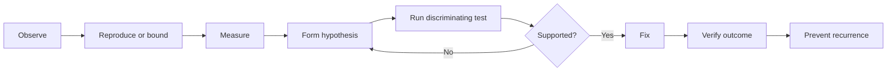

# Debugging Mindset

## Why this Principle Exists

Under uncertainty and time pressure, engineers can confuse correlation with cause, change several variables at once, and destroy useful evidence. A disciplined debugging method reduces recovery time and prevents recurrence.

## Philosophy

Debugging is controlled learning. Observe the symptom precisely, reproduce or bound it, form falsifiable hypotheses, run the cheapest discriminating test, and update the model. Restore service safely, but distinguish mitigation from explanation and prevention.

## Core Ideas

- **Observe:** Capture symptoms, timing, scope, change history, and user impact without premature interpretation.
- **Reproduce:** Create the smallest representative case or identify the conditions under which behavior appears.
- **Measure:** Use logs, metrics, traces, profiles, dumps, and controlled probes to replace guesses.
- **Hypothesize:** State a mechanism that predicts evidence, not merely a suspected component.
- **Validate:** Change one variable or choose a test that distinguishes competing hypotheses.
- **Fix:** Address the causal mechanism with proportionate validation and a recovery path.
- **Prevent recurrence:** Improve tests, design, telemetry, limits, runbooks, and alerts based on what allowed the issue.

## Engineering Mindset

Maintain a timeline and an evidence ledger: what is known, what is inferred, what has been ruled out, and what test comes next. Protect the system while investigating. In production, prefer reversible probes and mitigations with bounded blast radius.

## Real World Examples

1. **Intermittent failure:** Compare successful and failed requests by time, input, dependency, instance, and change cohort before restarting everything.
2. **Recent deployment:** Treat temporal proximity as a strong lead, not proof; test rollback or cohort behavior while checking concurrent environment changes.
3. **Resource exhaustion:** Identify the resource, producer, retention path, and growth rate rather than increasing the limit as the only fix.

## Common Mistakes

- Changing several variables and losing the ability to identify cause.
- Restarting immediately when customer safety allows evidence to be captured first.
- Searching for confirmation of the first hypothesis rather than a test that could disprove it.
- Closing the issue after mitigation without verifying cause or prevention.

## Trade-offs

| Tension                      | Practical position                                                                                      |
| ---------------------------- | ------------------------------------------------------------------------------------------------------- |
| Recovery vs investigation    | Reduce customer harm first, while preserving safe evidence and noting which conclusions remain unknown. |
| Production realism vs safety | Use the least invasive probe that can distinguish hypotheses; reproduce elsewhere when risk is high.    |
| Depth vs time                | Investigate until the cause and prevention decision are supported, not until every detail is known.     |

## Technical Lead Perspective

The lead separates incident command from deep investigation where scale requires it, keeps evidence and hypotheses visible, prevents random action, and ensures specialists are engaged without fragmenting ownership. After recovery, they fund prevention and observability gaps.

## Questions to Ask Yourself

- What exactly is observed, and what is only inferred?
- Which hypothesis makes a unique prediction we can test safely?
- What evidence will be lost by this action?
- Have we verified recovery, cause, and recurrence prevention separately?

## Checklist

- [ ] Symptom, scope, impact, timeline, and recent changes are recorded.
- [ ] Known facts and hypotheses are separated.
- [ ] Tests are safe, discriminating, and change one material variable.
- [ ] Mitigation and root-cause work are tracked separately.
- [ ] The fix, recovery, and preventive controls are verified.

## References

- [Google SRE — Effective Troubleshooting](https://sre.google/sre-book/effective-troubleshooting/)
- [Google SRE — Postmortem Culture](https://sre.google/sre-book/postmortem-culture/)
- [AWS — Operate Workloads](https://docs.aws.amazon.com/wellarchitected/latest/operational-excellence-pillar/operate.html)

## Related Principles

- [Production Ownership](04-production-ownership.md)
- [Engineering Mindset](01-engineering-mindset.md)
- [Learning Culture](12-learning-culture.md)
- [Architecture Decision Records](../architecture/README.md)
- [Architecture decision template](https://github.com/srma4tech/aem-technical-lead-playbook/blob/main/templates/architecture-decision-record.md)
- [Architecture review checklist](https://github.com/srma4tech/aem-technical-lead-playbook/blob/main/checklists/architecture-review.md)
- [Repository roadmap](https://github.com/srma4tech/aem-technical-lead-playbook/blob/main/ROADMAP.md)

## Future Reading

- Fault isolation, distributed tracing, and controlled production diagnostics.
- Incident command and advanced root-cause analysis methods.
