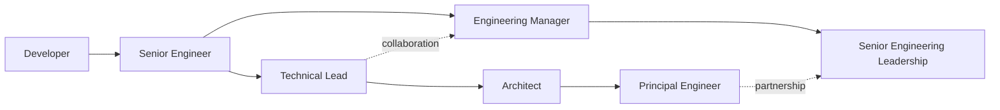

# Career Growth

## Why this Principle Exists

Career progression becomes unreliable when it is defined by tenure, title aspiration, or visible heroics. Engineers need a model based on sustained scope, judgment, influence, and outcomes, while recognizing that management and architecture are distinct paths.

## Philosophy

Growth means handling broader ambiguity and consequence while improving the capability of the surrounding system. Promotion follows demonstrated operation at scope; it is not a promise that development activity alone will produce a title.

## Core Ideas

- **Developer:** Deliver scoped changes correctly, seek feedback, test work, and build reliable foundations.
- **Senior engineer:** Own multi-component outcomes, make sound trade-offs, improve production health, and mentor locally.
- **Technical lead:** Create team-level clarity, coordinate decisions, manage technical risk, and grow others.
- **Architect:** Shape cross-system boundaries, quality attributes, evolution, and stakeholder decisions.
- **Principal engineer:** Influence organization-wide technical direction, mechanisms, and multi-year risk.
- **Engineering manager:** Own people systems, organizational delivery, staffing, feedback, and team health.
- **Evidence of scope:** Show repeatable outcomes, decision quality, leverage, and trust across an appropriate time horizon.

## Engineering Mindset

Choose the kind of problems and accountability you want, then identify the capabilities and evidence required. Seek assignments that expand one dimension—ambiguity, impact, time horizon, or organizational reach—without abandoning operational depth.

## Real World Examples

1. **Senior readiness:** An engineer repeatedly owns outcomes across design, delivery, operations, and follow-up—not merely larger implementations.
2. **Architect growth:** A lead practices cross-system quality-attribute decisions and migration strategy before seeking architecture by title.
3. **Management transition:** The candidate tests interest in coaching, staffing, performance, and organizational systems rather than treating management as the next technical rank.

## Common Mistakes

- Using hours, code volume, incident heroics, or meeting presence as primary evidence.
- Pursuing organization-wide influence before establishing reliable local judgment.
- Treating architect or manager titles as freedom from implementation and operations knowledge.
- Building a promotion packet around one project without sustained behavior or independent evidence.

## Trade-offs

| Tension                         | Practical position                                                                         |
| ------------------------------- | ------------------------------------------------------------------------------------------ |
| Depth vs breadth                | Maintain credible depth while broadening the system and stakeholders you can reason about. |
| Individual delivery vs leverage | Shift time toward decisions, mechanisms, and growing others as scope increases.            |
| Technical vs management track   | Choose by desired accountability; neither path is the default promotion from the other.    |

## Technical Lead Perspective

The lead makes expectations and opportunity visible. They give engineers scoped chances to demonstrate the next level, provide evidence-based feedback, prevent title inflation, and distinguish a skill gap from a missing opportunity or organizational constraint.

## Questions to Ask Yourself

- What outcomes and decisions define the next scope, not just the next title?
- Which capability has independent evidence, and which is still aspirational?
- Am I increasing leverage or simply accumulating more responsibilities?
- Which path matches the accountability I want to carry?

## Checklist

- [ ] Target scope and capability expectations are explicit.
- [ ] Growth assignments expand responsibility with support.
- [ ] Evidence covers outcomes, judgment, collaboration, and operations.
- [ ] Feedback comes from multiple relevant stakeholders over time.
- [ ] Technical and management paths are evaluated as distinct choices.

## References

- [ACM Code of Ethics](https://www.acm.org/code-of-ethics)
- [Google Engineering Practices](https://google.github.io/eng-practices/review/)
- [DORA — Continuous Delivery](https://dora.dev/capabilities/continuous-delivery/)

## Related Principles

- [Mentorship](13-mentorship.md)
- [Technical Lead Principles](02-technical-lead-principles.md)
- [Engineering Values](15-engineering-values.md)
- [Architecture Decision Records](../architecture/README.md)
- [Architecture decision template](https://github.com/srma4tech/aem-technical-lead-playbook/blob/main/templates/architecture-decision-record.md)
- [Architecture review checklist](https://github.com/srma4tech/aem-technical-lead-playbook/blob/main/checklists/architecture-review.md)
- [Repository roadmap](https://github.com/srma4tech/aem-technical-lead-playbook/blob/main/ROADMAP.md)

## Future Reading

- Role expectations, evidence portfolios, sponsorship, and promotion calibration.
- Principal engineering and engineering-management operating models.
