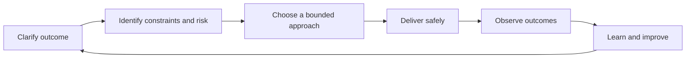

# Engineering Principles

## Why this Principle Exists

Technology changes faster than the obligations of engineering. Teams still have to understand a problem, choose among imperfect options, protect users, operate what they ship, and leave the system easier to change. These principles establish the judgment expected before any product- or language-specific guidance is applied.

## Philosophy

Engineering is the disciplined conversion of uncertain needs into sustainable outcomes. The work is not complete when code runs; it is complete when the outcome is understood, the risk is controlled, the system can be operated, and future engineers can change it safely. Principles guide decisions when procedures do not cover the situation.

## Core Ideas

- **Outcomes over output:** Evaluate work by customer and business results, not volume of code or activity.
- **Systems over components:** Consider dependencies, people, processes, failure modes, and operating conditions.
- **Evidence over intuition:** Measure behavior, state assumptions, and update decisions when evidence changes.
- **Simplicity over novelty:** Accept complexity only when it buys a named capability or reduces a larger risk.
- **Ownership over hand-offs:** Carry quality, security, operability, and learning through the full lifecycle.
- **Mechanisms over intentions:** Turn standards into repeatable reviews, automation, telemetry, and feedback loops.

## Engineering Mindset

Use a continuous reasoning loop: clarify the outcome, identify constraints, expose uncertainty, choose the smallest responsible action, observe the result, and incorporate what was learned. Seniority changes the size and duration of the system considered; it does not remove the need for evidence.

## Real World Examples

1. **A delivery deadline:** The team reduces scope and preserves security, rollback, and observability instead of silently borrowing risk from production.
2. **A recurring incident:** The response restores service, then changes the system, test, alert, or operating procedure that allowed recurrence.
3. **An architecture proposal:** The author names decision drivers and rejected options, then records the decision rather than presenting a diagram as proof.

## Common Mistakes

- Treating principles as slogans that do not change reviews, priorities, or operating practices.
- Applying one principle absolutely while ignoring context, such as maximizing reuse despite harmful coupling.
- Using “best practice” to avoid stating constraints, evidence, ownership, or trade-offs.
- Confusing local technical elegance with system-level or customer value.

## Trade-offs

| Tension                             | Practical position                                                                                                    |
| ----------------------------------- | --------------------------------------------------------------------------------------------------------------------- |
| Consistency vs context              | Standardize recurring decisions, but allow documented exceptions when constraints materially differ.                  |
| Speed vs assurance                  | Match assurance to blast radius and reversibility; do not remove essential controls to create an appearance of speed. |
| Present value vs future flexibility | Pay for flexibility only when a plausible change and its cost justify the option.                                     |

## Technical Lead Perspective

A technical lead makes these principles operational. The lead creates decision records, review criteria, quality gates, ownership boundaries, and feedback loops. The standard is visible in what the team rewards, what it blocks, and what it learns from—not only in written guidance.

## Questions to Ask Yourself

- What outcome are we responsible for, and how will we know it happened?
- Which assumptions and failure modes could invalidate the plan?
- What complexity or operational burden are we creating for future teams?
- What evidence would cause us to change direction?

## Checklist

- [ ] The problem, users, outcome, and constraints are explicit.
- [ ] Security, reliability, performance, operability, and maintenance have owners.
- [ ] The decision states trade-offs, evidence, and reversibility.
- [ ] Delivery includes validation, telemetry, rollback, and documentation.
- [ ] Learning is converted into a tracked improvement.

## References

- [Google Engineering Practices](https://google.github.io/eng-practices/review/)
- [AWS Well-Architected — Operational Excellence](https://docs.aws.amazon.com/wellarchitected/latest/operational-excellence-pillar/operational-excellence.html)
- [DORA — Continuous Delivery](https://dora.dev/capabilities/continuous-delivery/)

## Related Principles

- [Engineering Mindset](01-engineering-mindset.md)
- [Engineering Values](15-engineering-values.md)
- [Engineering Excellence](06-engineering-excellence.md)
- [Architecture Decision Records](../architecture/README.md)
- [Architecture decision template](../../templates/architecture-decision-record.md)
- [Architecture review checklist](../../checklists/architecture-review.md)
- [Repository roadmap](../../ROADMAP.md)

## Future Reading

- Apply the principles to the role-based learning path.
- Use future system-design chapters to practice principle-based trade-off analysis.
