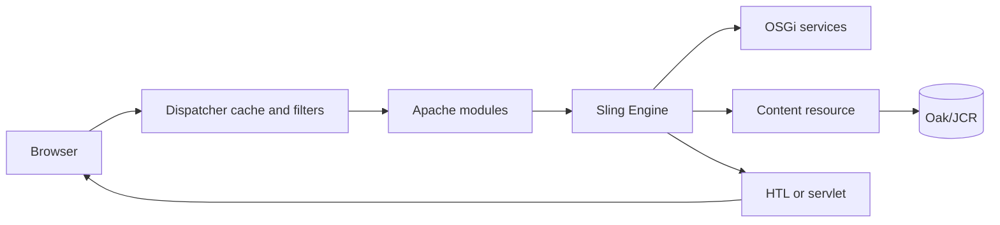

# How AEM Works

## Overview

AEM combines Sling's URL-to-content routing, an Oak-backed JCR repository, OSGi services, and a rendering layer. A request is not routed directly to a controller; it is interpreted against content and resource types.

## Why this Matters

This model explains why a URL can resolve without a servlet mapping, why a component change can affect runtime rendering, and why cache policy belongs to application architecture.

## Learning Objectives

- Distinguish edge delivery, Sling resolution, content access, and rendering.
- Identify the ownership boundary of Dispatcher, Apache, Sling, and Oak.
- Diagnose a request by following data and control flow.

## Architecture Overview

## Internal Working

Dispatcher may serve a cached representation. Otherwise Apache forwards a permitted request to AEM. Sling resolves a resource, derives a resource type, chooses a servlet or script, invokes services and repository access, then writes a response. OSGi supplies dynamic service wiring; it is not the request router.

## Request Flow

The request URI, selectors, extension, suffix, method, authentication state, and headers form the effective input. Content paths and `sling:resourceType` guide rendering; repository permissions constrain what code can read.

## Production Behaviour

Publish instances should be treated as horizontally scalable render nodes. Author traffic, replication, and administrative access have different cache and security profiles.

## Performance

Keep public pages cacheable, minimize repository reads per component, and measure backend render time separately from edge latency.

## Security

Enforce Dispatcher filters, least-privilege service users, repository ACLs, and safe response headers. Do not assume a blocked UI action is an authorization boundary.

## Debugging

Correlate a browser request with Dispatcher, Apache, and AEM request logs. Record whether the response was a cache hit before debugging Sling.

## Common Mistakes

- Treating AEM as a conventional controller-first MVC application.
- Granting broad administrative sessions to avoid permission failures.
- Measuring only AEM response time while cache misses dominate user latency.

## Best Practices

Model the request path, own headers and invalidation rules as code, and use service users for backend repository access.

## Design Trade-offs

More edge caching lowers origin load but increases invalidation complexity. Component flexibility improves authoring but can increase runtime dependency and query cost.

## Technical Lead Notes

Set a cacheability contract per endpoint. Monitor hit ratio, origin latency, error rate, and repository query health together; each alone gives an incomplete system picture.

## Production Story

A campaign page appeared fast in test but slowed under load because a personalization header bypassed cache for every visitor. Removing that header from anonymous traffic restored cache hits while preserving the personalized endpoint.

## Interview Readiness

### Developer Questions

What is the difference between a content resource and an OSGi service?

### Senior Questions

How would you prove that a slowdown is an edge-cache problem rather than an Oak problem?

### Technical Lead Questions

Which request classes deserve different caching and authorization policies?

### Adobe Style Questions

How does `sling:resourceType` participate in rendering?

### Scenario Based Questions

An anonymous page has high origin traffic. What evidence do you collect first?

### Architecture Questions

Where would you place a cross-cutting cache-control decision and why?

## References

- [Apache Sling Engine](https://sling.apache.org/documentation/the-sling-engine/)
- [Apache Jackrabbit Oak](https://jackrabbit.apache.org/oak/docs/)

## Cross References

- [Request Lifecycle](02-request-lifecycle.md)
- [Dispatcher Overview](03-dispatcher-overview.md)
