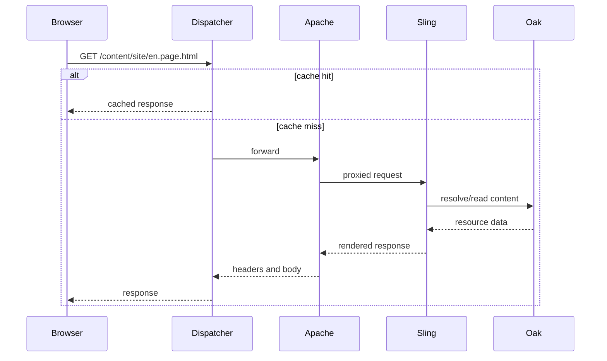

# Request Lifecycle

## Overview

The lifecycle begins before AEM receives bytes and ends after caches, clients, and observability systems consume the response. Each hop can reject, transform, cache, or forward it.

## Why this Matters

Most production investigations fail by starting at the wrong layer. A lifecycle map turns a vague "page is broken" report into testable boundaries.

## Learning Objectives

- Trace an incoming URL across edge, web, Sling, repository, and rendering layers.
- Identify the request attributes that alter resolution.
- Separate cache, authorization, and rendering failures.

## Architecture Overview

## Internal Working

Dispatcher evaluates filters and cache state. Apache handles virtual hosts, rewrites, and proxying. Sling decomposes the request path, resolves a resource, selects a handler, and applies filters. The handler may read Oak and invoke services before committing headers and body.

## Request Flow

Selectors (`.print`), extension (`.html`), suffix, method, and request path are independent inputs. Log the complete URI and method; do not reduce an incident to a path alone.

## Production Behaviour

Cache misses create a queueing multiplier: a small drop in hit ratio can sharply increase publish CPU, connection pools, and repository work.

## Performance

Budget latency by layer. Optimize a measured bottleneck, then retest cache hit and miss paths independently.

## Security

Validate at the earliest trustworthy layer, but retain authorization at the resource and service boundary. Rewrites must not create a bypass around protected paths.

## Debugging

Use a request ID where available and compare response headers, Dispatcher logs, Apache access/error logs, Sling request logs, and query traces.

## Common Mistakes

- Ignoring selectors and suffix while reproducing a defect.
- Calling a cache miss an AEM outage.
- Adding rewrites without testing authorization and cache keys.

## Best Practices

Document representative hit, miss, authenticated, and error flows. Test them after routing or cache configuration changes.

## Design Trade-offs

Early rejection protects origin capacity but can hide useful diagnostics. Detailed logs aid support but require privacy-aware retention and redaction.

## Technical Lead Notes

Define a common correlation field and ownership for each hop. A request lifecycle is an operational contract across teams, not merely an architecture diagram.

## Production Story

An image URL with a selector worked on publish but returned a 404 through the CDN. The CDN normalization removed the selector, changing Sling's resolution input. A cache-rule correction fixed the path without changing application code.

## Interview Readiness

### Developer Questions

Which URL parts influence Sling request parsing?

### Senior Questions

How do you distinguish a cache miss from a cache bypass?

### Technical Lead Questions

Which logs and metrics form a minimum request trace?

### Adobe Style Questions

Where do Sling filters fit in the lifecycle?

### Scenario Based Questions

A request is fast directly on publish but slow publicly. Where do you investigate?

### Architecture Questions

How would you design a safe request correlation strategy?

## References

- [Sling Request Processing](https://sling.apache.org/documentation/the-sling-engine/request-processing.html)

## Cross References

- [How AEM Works](01-how-aem-works.md)
- [How AEM Works](01-how-aem-works.md)
