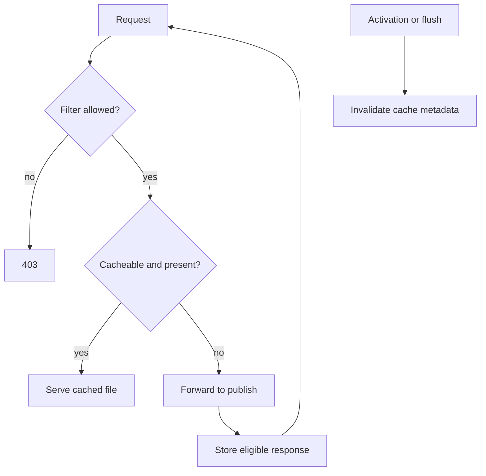

# Dispatcher Overview

## Overview

Dispatcher is Apache's AEM-aware caching and filtering module. It is both a performance control and a security boundary, so cache configuration is production code.

## Why this Matters

An incorrect rule can expose a path, make authoring changes appear stale, or send anonymous traffic to publish. Its failures often look like application defects.

## Learning Objectives

- Explain Dispatcher filtering, caching, invalidation, and forwarding.
- Choose cache keys and invalidation boundaries deliberately.
- Investigate hit, miss, bypass, and stale-content symptoms.

## Architecture Overview

## Internal Working

Filters decide whether a request is accepted. Cache rules decide if a response may be stored. Invalidation marks affected content stale; statfile levels and rules determine the scope. A miss is forwarded to publish and may populate the cache if its response and request are eligible.

## Request Flow

For each request, establish: selected farm, virtual host, filter result, cache key, cache status, forwarded target, response headers, and invalidation state.

## Production Behaviour

Cache hit ratio is an availability lever. During origin degradation, a warm cache can protect readers; during an invalidation storm, it can expose capacity limits.

## Performance

Avoid caching content whose variation is not represented by a safe key. Prefer explicit cache-control contracts over accidental caching behavior.

## Security

Start with deny-by-default filters. Validate query-string, selector, extension, and suffix patterns; a permissive path rule can be bypassed through variants.

## Debugging

Inspect the resolved farm and Dispatcher logs, then confirm filesystem cache state and response headers. Test from the same hostname used by clients.

## Common Mistakes

- Allowing broad `/content` paths without selector or extension constraints.
- Assuming activation deletes every cached artifact immediately.
- Caching authenticated or user-specific responses.

## Best Practices

Version and review Dispatcher rules, test positive and negative filter cases, and monitor invalidation volume alongside cache hit ratio.

## Design Trade-offs

Fine-grained invalidation reduces staleness but increases configuration and operational complexity. Broad invalidation is simpler but can create expensive cache-cold periods.

## Technical Lead Notes

Treat cache strategy as an API between content authors, application teams, and operations. Establish a documented freshness target for every public content class.

## Production Story

A navigation update remained stale because the page cache was invalidated but a shared fragment had a separate cache path. Aligning invalidation rules with the component dependency restored predictable freshness.

## Interview Readiness

### Developer Questions

What is the purpose of Dispatcher filtering?

### Senior Questions

How do statfile levels affect invalidation scope?

### Technical Lead Questions

What cache contract would you define for a personalized homepage?

### Adobe Style Questions

Why is Dispatcher not only a cache?

### Scenario Based Questions

Activated content is stale for some visitors. What do you inspect?

### Architecture Questions

How do you balance freshness and origin protection?

## References

- [Dispatcher Documentation](https://experienceleague.adobe.com/en/docs/experience-manager-dispatcher/using/dispatcher)

## Cross References

- [Apache Web Server](04-apache-web-server.md)
- [Request Lifecycle](02-request-lifecycle.md)
