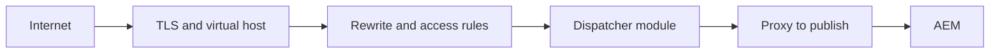

# Apache Web Server

## Overview

Apache HTTP Server terminates or proxies HTTP traffic and hosts Dispatcher. Virtual hosts, rewrites, modules, TLS, and proxy rules shape the request before Sling sees it.

## Why this Matters

Many apparent AEM routing errors originate in host matching, rewrite order, or a proxy header. Apache is part of the runtime architecture, not passive plumbing.

## Learning Objectives

- Identify the Apache responsibilities around AEM publish.
- Reason about virtual-host and rewrite ordering.
- Debug proxy, TLS, and header propagation defects.

## Architecture Overview

## Internal Working

Apache selects a virtual host from the connection and Host header, then applies configured directives and modules. Rewrites can change the effective URI before Dispatcher evaluates it. Proxy settings pass a request to the chosen AEM origin, with selected headers preserved or added.

## Request Flow

Verify hostname, scheme, port, virtual host, rewritten URI, selected farm, and upstream target. This sequence catches most edge routing defects.

## Production Behaviour

Connection reuse, timeouts, TLS policy, and upstream health determine how a traffic spike reaches AEM. Bad timeouts can turn a slow dependency into worker exhaustion.

## Performance

Keep rewrite rules deterministic and inexpensive. Tune connection and proxy timeouts from measured upstream behavior, not a generic large number.

## Security

Use modern TLS, restrict administrative virtual hosts, sanitize forwarded headers, and make trusted-proxy assumptions explicit.

## Debugging

Read access and error logs together. Reproduce with the correct Host header; a direct IP request may select a different virtual host.

## Common Mistakes

- Testing a URL without its production host name.
- Rewriting protected paths before access rules are evaluated.
- Trusting client-supplied forwarded identity headers.

## Best Practices

Keep virtual hosts narrowly scoped, test rewrites as a matrix, and log upstream status and duration.

## Design Trade-offs

Centralized rewrites simplify public URLs but can obscure application ownership. More diagnostic logging improves support but needs privacy controls.

## Technical Lead Notes

Make Apache configuration reviewable alongside application changes. Define who owns certificates, timeouts, headers, and incident response for the edge tier.

## Production Story

A redirect loop appeared only behind HTTPS because the origin did not receive the original scheme. Passing and trusting the correct proxy scheme header fixed the loop while keeping direct-origin access restricted.

## Interview Readiness

### Developer Questions

What does a virtual host decide?

### Senior Questions

Why can rewrite order alter Dispatcher behavior?

### Technical Lead Questions

Which upstream timeout signals should trigger capacity work?

### Adobe Style Questions

How does Apache relate to Dispatcher?

### Scenario Based Questions

Why might an endpoint work with a local host but fail publicly?

### Architecture Questions

Where should TLS termination and trusted-header policy live?

## References

- [Apache HTTP Server Documentation](https://httpd.apache.org/docs/)

## Cross References

- [Dispatcher Overview](03-dispatcher-overview.md)
- [Request Lifecycle](02-request-lifecycle.md)
