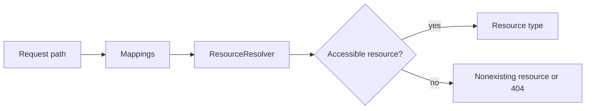

# Resource Resolution

## Overview

Resource resolution maps a request path to a Sling `Resource`, applying search paths, mappings, and the caller's permissions. It is separate from selecting code to render that resource.

## Why this Matters

A wrong resource makes every later diagnostic misleading. Resolution also determines which repository view and ACLs a request can observe.

## Learning Objectives

- Explain path mapping, search paths, and resource types.
- Separate resource existence from accessibility.
- Trace resolution before debugging handlers.

## Architecture Overview

## Internal Working

The resolver turns a URL into a resource through configured mappings and repository lookup. A resource can be synthetic or nonexisting. Its `sling:resourceType`, rather than its JCR primary type, usually drives later rendering.

## Request Flow

Capture the external URL, mapped path, resolved resource path, type, supertype, and principal. Test the same path with the same identity.

## Production Behaviour

Mappings create useful public URLs but add an indirection that must be versioned and monitored during deployments.

## Performance

Avoid repeatedly resolving the same path in component loops. Prefer a known resource tree traversal over many independent resolver calls.

## Security

Resolution respects repository permissions; do not replace an inaccessible result with a privileged lookup unless the use case explicitly requires it.

## Debugging

Use the resource resolver console and request logs. Check mappings and permissions before changing servlet registrations.

## Common Mistakes

- Assuming the URL maps directly to a JCR node.
- Treating a nonexisting resource as an application exception.
- Using an administrative resolver to conceal ACL defects.

## Best Practices

Keep mappings intentional, resource types stable, and service-user access narrow.

## Design Trade-offs

Friendly URLs improve product design but complicate traceability. Resource-type inheritance improves reuse but increases the importance of clear ownership.

## Technical Lead Notes

Review mapping changes like API changes. Require tests for both public URL behavior and the internal resource that is resolved.

## Production Story

A vanity URL rendered the wrong locale after a new mapping had higher precedence. Inspecting the resolved resource, not the component, revealed the issue.

## Interview Readiness

### Developer Questions

What does `ResourceResolver` return for an absent path?

### Senior Questions

How do mappings and search paths influence resolution?

### Technical Lead Questions

How would you govern vanity URL ownership?

### Adobe Style Questions

What is a Sling resource type?

### Scenario Based Questions

Why can a URL resolve differently for two users?

### Architecture Questions

Where should public URL mapping be controlled?

## References

- [Sling Resources](https://sling.apache.org/documentation/the-sling-engine/resources.html)

## Cross References

- [Sling Engine](05-sling-engine.md)
- [Servlet Resolution](07-servlet-resolution.md)
