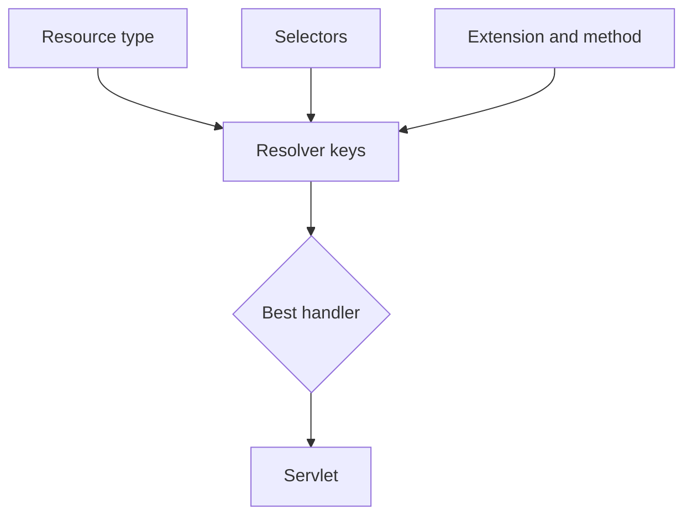

# Servlet Resolution

## Overview

After Sling resolves a resource, servlet resolution chooses a registered handler from resource type, selectors, extension, method, and request path metadata.

## Why this Matters

Servlet ambiguity produces intermittent-looking 404s, wrong output, and upgrade hazards. A precise registration is an executable endpoint contract.

## Learning Objectives

- Read the inputs used by the servlet resolver.
- Register resource-type handlers safely.
- Diagnose missing or competing registrations.

## Architecture Overview

## Internal Working

Sling derives candidate registrations from request and resource metadata. Resource-type registrations are generally safer than broad path registrations because they preserve content-model intent. Selector order is meaningful.

## Request Flow

Log the resolved resource type plus selectors, extension, method, and suffix; then compare them with the component registration properties.

## Production Behaviour

Bundle activation and component registration determine availability. A deployed class is not a usable servlet until its OSGi component is active.

## Performance

Keep servlets thin: validate input, delegate domain work, stream when possible, and avoid unbounded repository queries.

## Security

Treat selectors and suffixes as untrusted input. Enforce method and authorization checks close to the capability being exposed.

## Debugging

Inspect OSGi components and Sling servlet resolver output. A 404 can mean no handler, blocked Dispatcher traffic, or an inaccessible resource.

## Common Mistakes

- Registering by path without a durable endpoint reason.
- Forgetting method or extension constraints.
- Expecting selector order to be ignored.

## Best Practices

Use narrow registration properties, tests for valid and invalid variants, and stable selector namespaces.

## Design Trade-offs

Resource-type servlets are composable; path servlets are explicit for operational endpoints. Choose based on ownership, not convenience.

## Technical Lead Notes

Maintain an endpoint inventory. Reject registrations that overlap without an intentional precedence decision.

## Production Story

An export servlet stopped resolving when a team added a selector in a different order. Contract tests for canonical selector order prevented the regression.

## Interview Readiness

### Developer Questions

Which request properties can select a servlet?

### Senior Questions

Why prefer resource-type registrations?

### Technical Lead Questions

How do you prevent endpoint collisions across teams?

### Adobe Style Questions

What is the impact of selector order?

### Scenario Based Questions

A servlet class exists but requests return 404. What do you inspect?

### Architecture Questions

When is a path servlet justified?

## References

- [Sling Servlets](https://sling.apache.org/documentation/the-sling-engine/servlets.html)

## Cross References

- [Resource Resolution](06-resource-resolution.md)
- [Script Resolution](08-script-resolution.md)
