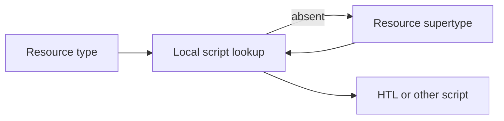

# Script Resolution

## Overview

Script resolution finds a rendering script from a resource type and request characteristics. It allows components to inherit behavior through resource supertypes.

## Why this Matters

The script selected at runtime may not sit in the component folder an engineer first inspects. Inheritance is powerful only when its chain is understandable.

## Learning Objectives

- Explain script naming and resource-type lookup.
- Follow `sling:resourceSuperType` fallback.
- Diagnose overlays and missing scripts.

## Architecture Overview

## Internal Working

Sling searches the resource type location, then follows the supertype chain and search paths. Script names encode request characteristics, so extension and selectors can select different renderers.

## Request Flow

Resolve the resource first, then list its type and inheritance chain before assuming a script is missing.

## Production Behaviour

Overlays can shadow product behavior. Package order and content deployment determine which definitions are visible.

## Performance

Prefer shallow inheritance and small render units. A script that includes many components can multiply repository reads and model adaptation.

## Security

Never use request input to construct include paths. Keep sensitive logic in Java services, not presentation scripts.

## Debugging

Inspect component definitions and the inheritance chain. Test the exact selector and extension used in production.

## Common Mistakes

- Editing a script that is not the selected renderer.
- Creating an overlay for a behavior that should be configured.
- Making supertype chains too deep to reason about.

## Best Practices

Use explicit resource types, documented overlays, and component tests for the rendered contract.

## Design Trade-offs

Inheritance reduces duplication but hides behavior location. Local scripts are easy to discover but can fragment shared patterns.

## Technical Lead Notes

Set an overlay policy and periodically inventory supertype chains after upgrades.

## Production Story

A product upgrade changed a parent component's script and altered a custom component unexpectedly. Pinning and reviewing the inheritance contract fixed the release process.

## Interview Readiness

### Developer Questions

What is `sling:resourceSuperType` used for?

### Senior Questions

How do you find the actual script selected?

### Technical Lead Questions

What governance is needed for overlays?

### Adobe Style Questions

How does resource type inheritance affect scripts?

### Scenario Based Questions

A component renders a parent view. Where do you look?

### Architecture Questions

When is inheritance preferable to composition?

## References

- [Sling Script Resolution](https://sling.apache.org/documentation/the-sling-engine/script-resolution.html)

## Cross References

- [Servlet Resolution](07-servlet-resolution.md)
- [HTL Rendering](09-htl-rendering.md)
