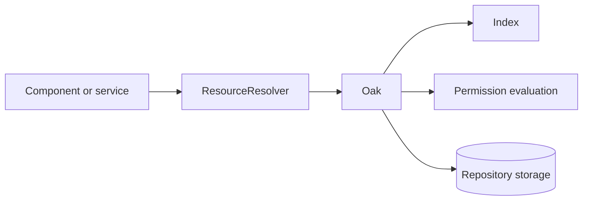

# JCR Content Repository

## Overview

The JCR repository stores content and configuration as a hierarchical model. Oak supplies storage, indexing, queries, and permission evaluation beneath AEM's content APIs.

## Why this Matters

Repository access drives both correctness and scalability. Query traversal, excessive session use, and permissive service identities become production incidents under load.

## Learning Objectives

- Explain nodes, properties, resources, sessions, and indexes.
- Identify query and permission performance risks.
- Use service users and bounded repository access.

## Architecture Overview

## Internal Working

Oak evaluates repository reads through indexes and permissions. Sling projects repository content as resources. A query without a suitable index may traverse many nodes, increasing latency and pressure on shared infrastructure.

## Request Flow

For data-heavy requests, record the query, index plan, result size, principal, and number of repository round trips.

## Production Behaviour

Publishing, indexing, replication, and authoring compete for repository resources. A query that passes with sample content may fail at production cardinality.

## Performance

Design indexes from real query shapes, constrain paths and result size, and inspect query plans. Never normalize traversal warnings away.

## Security

Use service-user mappings and close resolvers promptly. Permissions are part of the query's cost and its data contract.

## Debugging

Use query explain tools, slow-query logs, and heap/thread evidence. Verify index state before treating every slow read as a code issue.

## Common Mistakes

- Querying broad repository roots without an index.
- Leaking `ResourceResolver` instances.
- Using an administrator identity for application services.

## Best Practices

Define indexes with feature code, test representative content volumes, and use explicit service-user permissions.

## Design Trade-offs

Indexes speed reads but consume storage and indexing work. Denormalized content can reduce queries but complicates authoring and consistency.

## Technical Lead Notes

Require a query plan for new search-like features. Track resolver leaks and traversal warnings as release-blocking operational debt.

## Production Story

A navigation query traversed the entire site after content growth. Adding a constrained index and path predicate converted a multi-second render into a predictable read.

## Interview Readiness

### Developer Questions

What is the relationship between a JCR node and a Sling resource?

### Senior Questions

Why is an Oak traversal warning serious?

### Technical Lead Questions

How do you review an indexing change safely?

### Adobe Style Questions

Why should service users have narrow permissions?

### Scenario Based Questions

Publish CPU rises after a content import. What repository evidence do you seek?

### Architecture Questions

When would you denormalize content instead of query it?

## References

- [Oak Query and Indexing](https://jackrabbit.apache.org/oak/docs/query/indexing.html)

## Cross References

- [HTL Rendering](09-htl-rendering.md)
- [Request Lifecycle](02-request-lifecycle.md)
