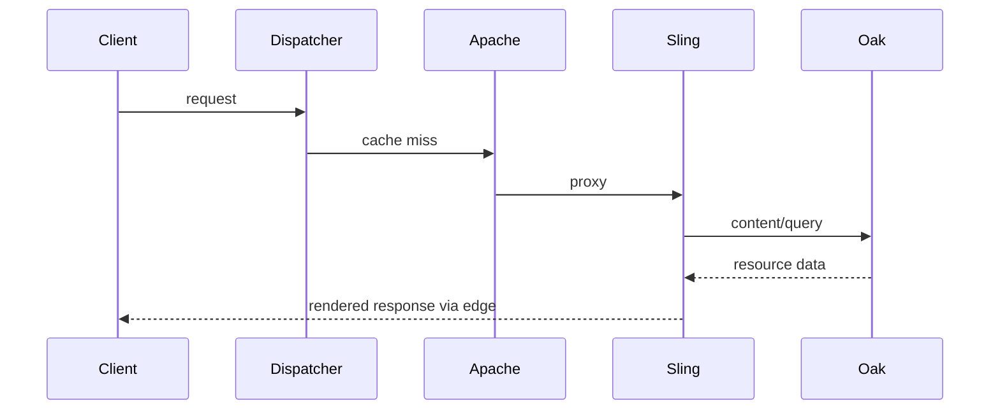

# End-to-End Request Flow

## Overview

An end-to-end trace joins edge policy, Apache routing, Sling resolution, repository access, rendering, and response delivery into one observable transaction.

## Why this Matters

System incidents cross ownership boundaries. A shared trace avoids "not my layer" hand-offs and focuses the team on evidence.

## Learning Objectives

- Build an evidence-led request trace.
- Identify the first failed or slow boundary.
- Communicate cross-layer findings clearly.

## Architecture Overview

## Internal Working

The effective transaction is defined by hostname, URI, identity, request headers, selected farm, mapped resource, handler, repository work, and response headers.

## Request Flow

Start at the client outcome, classify hit or miss, then move inward one layer at a time. Record timestamps instead of relying on narrative recollection.

## Production Behaviour

The slowest saturated dependency sets user experience. Retry and timeout behavior can turn a localized delay into broad capacity loss.

## Performance

Use layer budgets and percentile latency. Averages conceal cache-miss tails and query hotspots.

## Security

Trace identifiers must not contain customer data. Preserve authentication boundaries while collecting diagnostic evidence.

## Debugging

Use a repeatable capture sheet: URL, Host, method, headers, cache result, upstream duration, resource type, query plan, status.

## Common Mistakes

- Changing code before proving the layer at fault.
- Comparing direct publish requests to public cached requests.
- Omitting Host or authentication context.

## Best Practices

Automate synthetic hit and miss checks, preserve representative logs, and rehearse a cross-team trace during quiet periods.

## Design Trade-offs

More tracing improves diagnosis but costs storage and requires careful redaction. Sampling reduces cost but can miss rare failures.

## Technical Lead Notes

Make the trace template part of incident process and align service-level objectives with cache and origin metrics.

## Production Story

An intermittent 503 was traced to an Apache upstream timeout, not Sling. Increasing capacity without fixing the timeout would have hidden the condition until the next spike.

## Interview Readiness

### Developer Questions

Which fields reproduce a request accurately?

### Senior Questions

How do you localize latency across layers?

### Technical Lead Questions

Who owns an incident that crosses edge and application teams?

### Adobe Style Questions

Where does Sling enter the end-to-end flow?

### Scenario Based Questions

Public requests fail but direct origin requests pass. What is your hypothesis order?

### Architecture Questions

What observability design supports this flow?

## References

- [OpenTelemetry Documentation](https://opentelemetry.io/docs/)

## Cross References

- [Production Request Flow](13-production-request-flow.md)
- [Common Request Problems](14-common-request-problems.md)
