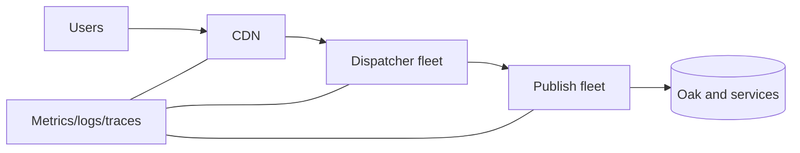

# Production Request Flow

## Overview

Production flow adds real constraints: CDN behavior, load balancing, authentication, deployment drift, invalidation, telemetry, and failure isolation.

## Why this Matters

Local success proves only a small part of the production path. Reliability comes from designing the whole operating system around the request.

## Learning Objectives

- Model production-only request variables.
- Plan safe cache warm-up, invalidation, and rollback.
- Use operational signals to make release decisions.

## Architecture Overview

## Internal Working

Production requests may be routed differently by geography, hostname, cookies, or health. Deployments change code and cache state at different times; invalidation is therefore a distributed consistency operation.

## Request Flow

Test canonical public URLs through the real ingress. Include cold-cache, warm-cache, authenticated, and rollback paths.

## Production Behaviour

Protect publish with rate limits, cache capacity, circuit-breaking dependencies, and explicit degradation. Let health checks reflect user-serving capability, not merely process liveness.

## Performance

Watch hit ratio, backend percentiles, saturation, error rate, and cache eviction after releases. Warm selectively from real traffic priorities.

## Security

Maintain separate author and publish exposure, rotate credentials, and audit administrative routing. Production diagnostics must protect personal data.

## Debugging

Compare configuration versions and deployment timestamps across nodes. Drift is a first-class hypothesis.

## Common Mistakes

- Treating cache invalidation as instantaneous deletion.
- Releasing without a cold-cache capacity plan.
- Calling a node healthy while dependencies are unusable.

## Best Practices

Use immutable configuration, rollback runbooks, canary observations, and defined freshness objectives.

## Design Trade-offs

Long TTLs improve resilience but slow content correction. Aggressive health checks fail fast but can cause cascading removals.

## Technical Lead Notes

Define release gates around customer outcomes: error budget, cache behavior, p95 latency, and content freshness. Redesign when operational complexity exceeds team ability to safely operate it.

## Production Story

A deployment caused a cache-cold surge that saturated publish. Staged warming and a temporary rate cap made later releases predictable.

## Interview Readiness

### Developer Questions

Why does a production cache miss matter more than a local miss?

### Senior Questions

How do you detect configuration drift?

### Technical Lead Questions

What release signals decide rollback?

### Adobe Style Questions

How does Dispatcher fit in a publish fleet?

### Scenario Based Questions

Content is fresh on one node and stale on another. What do you investigate?

### Architecture Questions

How do you design for a cache-cold event?

## References

- [Google SRE: Service Level Objectives](https://sre.google/workbook/slo-engineering-case-studies/)

## Cross References

- [End-to-End Request Flow](12-end-to-end-request-flow.md)
- [Dispatcher Overview](03-dispatcher-overview.md)
