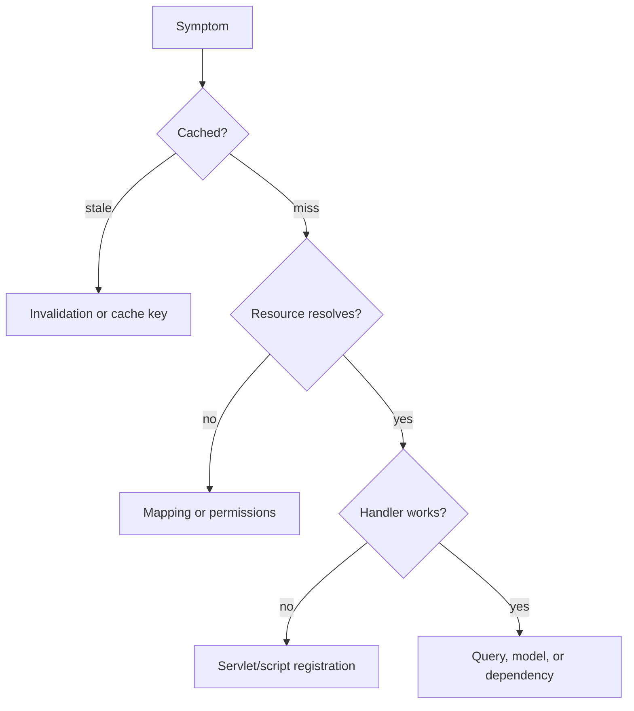

# Common Request Problems

## Overview

Recurring request failures cluster into cache, routing, resolution, permission, repository, rendering, and response classes. Classification shortens recovery.

## Why this Matters

The same symptom can arise at several layers. A disciplined differential diagnosis prevents high-risk configuration changes during an incident.

## Learning Objectives

- Classify common symptoms by likely boundary.
- Gather decisive evidence before changing configuration.
- Turn incidents into durable preventative controls.

## Architecture Overview

## Internal Working

Stale content points to cache key or invalidation. A 404 can be a filter, mapping, resource, or handler failure. A 403 generally needs an identity and ACL trace. Slow requests require cache and query evidence.

## Request Flow

Reproduce exact URL, Host, identity, method, selectors, headers, and timestamp, then work from edge to origin.

## Production Behaviour

Traffic amplifies small defects: cache bypass creates origin load, traversal creates queueing, and retries create further saturation.

## Performance

Treat traversal warnings, resolver leaks, low hit ratio, and elevated upstream duration as leading indicators, not cleanup work.

## Security

Do not relax Dispatcher filters or ACLs as a quick fix. Prove the intended access contract first.

## Debugging

Collect response headers, edge logs, Apache logs, Sling request traces, OSGi state, and Oak query plans according to the symptom.

## Common Mistakes

- Clearing all caches before preserving evidence.
- Testing only direct origin URLs.
- Fixing a 403 with broader service permissions.

## Best Practices

Maintain symptom runbooks, safe diagnostic commands, and regression tests for each repaired incident.

## Design Trade-offs

Global cache clears recover quickly but create load. Extra diagnostics improve recovery but must be controlled in normal operation.

## Technical Lead Notes

Track repeat incident classes. Redesign contracts or tooling when a runbook is used repeatedly; repetition is architecture feedback.

## Production Story

An alleged servlet failure was a Dispatcher filter rejecting a selector variant. A negative filter test was added beside the endpoint test.

## Interview Readiness

### Developer Questions

What evidence separates a 404 resource failure from handler failure?

### Senior Questions

How do you investigate a cache bypass?

### Technical Lead Questions

Which recurring incidents justify platform investment?

### Adobe Style Questions

What can cause a Sling request to return 404?

### Scenario Based Questions

An activation is not visible publicly. What is your diagnostic sequence?

### Architecture Questions

How do you make troubleshooting safer at scale?

## References

- [AEM Dispatcher Top Issues FAQ](https://experienceleague.adobe.com/en/docs/experience-manager-dispatcher/using/troubleshooting/dispatcher-faq)

## Cross References

- [Dispatcher Overview](03-dispatcher-overview.md)
- [End-to-End Request Flow](12-end-to-end-request-flow.md)
