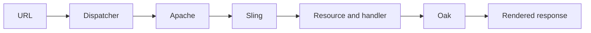

# Interview Readiness

## Overview

Interview readiness is the ability to explain an AEM request as a system, make trade-offs explicit, and lead a safe investigation rather than recite configuration names.

## Why this Matters

Senior and lead interviews test judgment under ambiguity. The same skill is required for architecture reviews and production ownership.

## Learning Objectives

- Build concise, accurate explanations of AEM internals.
- Structure scenario answers around evidence and risk.
- Connect implementation choices to operational outcomes.

## Architecture Overview

## Internal Working

Explain the request in order: edge decision, web-server routing, Sling resource resolution, servlet or script selection, repository access, rendering, response headers, and cache outcome.

## Request Flow

For any scenario, state inputs, expected boundary behavior, observability, likely failure modes, and the lowest-risk next action.

## Production Behaviour

Strong answers include cache hit ratio, invalidation, capacity, permissions, deployment drift, and recovery—not just code.

## Performance

Mention measured bottlenecks, Oak indexes, component render cost, cacheability, and percentiles rather than generic optimization advice.

## Security

Include Dispatcher filtering, least-privilege service users, ACLs, escaping, and response headers in relevant designs.

## Debugging

Start with reproducibility and edge/origin comparison. Name logs, response headers, request metadata, and query plans you would inspect.

## Common Mistakes

- Presenting a product feature without explaining its runtime effect.
- Offering a fix before gathering discriminating evidence.
- Ignoring operational ownership and rollback.

## Best Practices

Practice one-minute flow explanations, then expand with trade-offs and a realistic incident example.

## Design Trade-offs

Every answer should name a tension: freshness versus resilience, reuse versus discoverability, flexibility versus endpoint clarity, or diagnostics versus privacy.

## Technical Lead Notes

Assess candidates on how they reduce risk across teams. A lead should turn unknowns into experiments, align ownership, and define when to redesign.

## Production Story

In an interview scenario, a candidate proposed clearing cache immediately. A stronger answer preserved headers and logs, isolated the cache key, then made a targeted invalidation with a regression test.

## Interview Readiness

### Developer Questions

Walk through a request from Dispatcher to HTL.

### Senior Questions

How do resource type, selectors, and extension choose a handler?

### Technical Lead Questions

How do you make cache invalidation an engineering contract?

### Adobe Style Questions

Explain Sling resolution versus servlet resolution.

### Scenario Based Questions

An anonymous page is slow only after activation. How do you investigate?

### Architecture Questions

Design a safe and observable public-content delivery path.

## References

- [Apache Sling Documentation](https://sling.apache.org/documentation/)
- [Oak Documentation](https://jackrabbit.apache.org/oak/docs/)

## Cross References

- [How AEM Works](01-how-aem-works.md)
- [Common Request Problems](14-common-request-problems.md)
