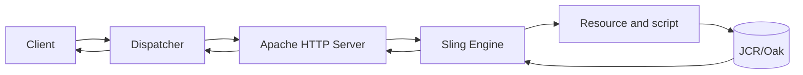

# Understanding AEM Internals

This part follows a request from an edge cache to a rendered response. It is an engineering model, not a product feature list: use it to reason about correctness, latency, cacheability, and failures.

## Reading Path

1. Start with [how AEM works](01-how-aem-works.md) and the [request lifecycle](02-request-lifecycle.md).
2. Learn the edge layers: [Dispatcher](03-dispatcher-overview.md) and [Apache](04-apache-web-server.md).
3. Follow Sling through [resource](06-resource-resolution.md), [servlet](07-servlet-resolution.md), [script](08-script-resolution.md), [HTL](09-htl-rendering.md), and [JCR](10-jcr-content-repository.md).

## Operating Model

The fastest request is usually one that never reaches AEM. The safest uncached request is one whose resolution path, permissions, dependencies, and response headers are explicit and observable.

## Cross References

- [Dispatcher checklist](../12-checklists/README.md)
- [Production support](../11-production-support/README.md)
- [AEM Core](../02-aem-core/README.md)
