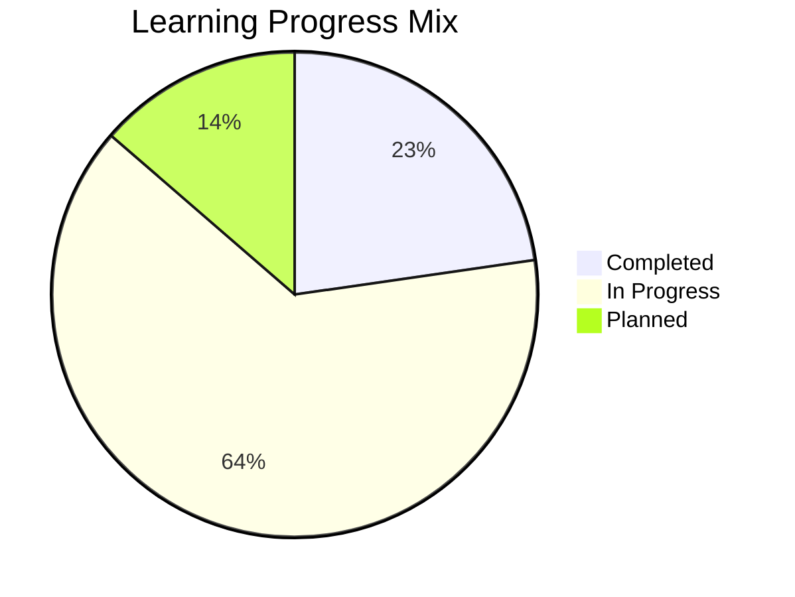
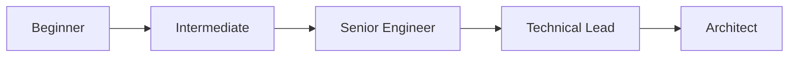
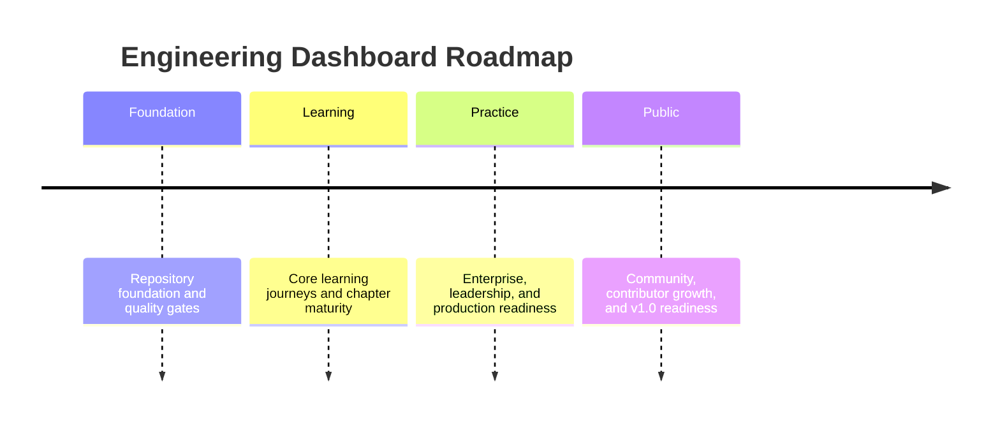

# Engineering Dashboard

!!! tip "Project status"
    This dashboard is the central status surface for the AEM Technical Lead Playbook. It highlights the project’s maturity, learning progress, release movement, and platform readiness without repeating the full handbook content.

## Repository Health

The repository is evolving from a strong documentation foundation into an engineering education platform with clearer delivery signals, role-based progression, and production-readiness language.

| Area | Status | Signal |
| --- | --- | --- |
| Documentation Coverage | Strong | Core handbook structure, learning topology, and navigation are now in place. |
| Repository Quality | Strong | Formatting, linting, spell checking, link validation, and strict MkDocs validation are all part of the quality bar. |
| Architecture Documentation | Strong | ADRs, folder structure guidance, and documentation architecture patterns are documented and maintained. |
| Learning Content | In Progress | Foundational and role-based chapters are being expanded into a richer learning experience. |
| Interview Readiness | In Progress | Interview-related material is being structured for practical senior-level preparation. |
| Technical Leadership | In Progress | Leadership and production stewardship patterns are being formalized. |
| Production Engineering | In Progress | Operational reasoning and support readiness are becoming core curriculum themes. |
| Open Source Readiness | Strong | Governance, contribution guidance, release strategy, and repository ownership signals are established. |
| Community Growth | In Progress | The project is positioned for broader maintainership, contributor onboarding, and public adoption. |
| Overall Progress | 74% | The project has a stable foundation and a clear roadmap for maturity expansion. |

## Current Release

| Item | Value |
| --- | --- |
| Current Version | `v0.4.0` |
| Release Date | `2026-08-01` |
| Latest Completed Features | Homepage experience refresh, chapter landing-page upgrades, release dashboard expansion, and stricter docs validation alignment. |
| Upcoming Release | `v0.5.0` |
| Release Notes | Delivery quality, academic UX, documentation navigation improvements, and a more polished project status experience. |

## Learning Progress

### Completed chapters

- [Introduction](00-introduction/README.md)
- [Engineering Principles](00-engineering-principles/README.md)
- [Learning Roadmap](01-learning-roadmap/README.md)
- [Understanding AEM Internals](20-understanding-aem-internals/README.md)
- [Repository Foundations and Governance](https://github.com/srma4tech/aem-technical-lead-playbook/blob/main/README.md)

### Chapters currently under development

- [AEM Core](02-aem-core/README.md)
- [Dispatcher](03-dispatcher/README.md)
- [Performance](04-performance/README.md)
- [Security](05-security/README.md)
- [AEM as a Cloud Service](06-aemaacs/README.md)
- [Enterprise Java](07-enterprise-java/README.md)
- [Design Patterns](08-design-patterns/README.md)
- [System Design](09-system-design/README.md)
- [Technical Leadership](10-technical-lead/README.md)
- [Production Support](11-production-support/README.md)
- [Engineering Checklists](12-checklists/README.md)
- [Interview Guide](13-interview-guide/README.md)
- [Case Studies](14-case-studies/README.md)
- [Reference](15-reference/README.md)

### Planned chapters

- Advanced enterprise architecture playbooks
- Public ready-to-ship release and maintainer enablement
- Broader contributor-led editorial maturity model

## Repository Statistics

These figures represent the current repository structure and documentation asset breadth.

| Metric | Count |
| --- | ---: |
| Markdown Pages | 61 |
| Architecture Diagrams | 8 |
| Mermaid Diagrams | 0 |
| Templates | 9 |
| Checklists | 10 |
| ADRs | 7 |
| Interview Questions | 1 |
| Production Stories | 0 |
| Examples | 0 |
| Cross References | 61 |

!!! note "Maintenance note"
    Repository statistics should be updated as the project grows. The current counts represent the present documentation and asset inventory used to support the handbook.

## Learning Paths

### Progress by role

| Learning Path | Status | Progress |
| --- | --- | --- |
| Beginner | Active foundation | 78% |
| Intermediate | In progress | 66% |
| Senior Engineer | Emerging | 58% |
| Technical Lead | Planned expansion | 44% |
| Architect | Future readiness | 31% |

## Roadmap

### Status summary

- Completed: repository foundation, navigation, governance, release strategy, and core handbook setup.
- In Progress: learning path expansion, chapter maturity, and platform polish.
- Planned: advanced enterprise practice, public readiness, and community growth.
- Future Vision: a globally discoverable, contributor-led engineering platform for AEM and technical leadership education.

## Engineering Mentor AI

!!! warning "Coming Soon"
    This section is reserved for future AI-driven coaching and engineering guidance.

Planned capabilities:

- Interactive Learning
- Interview Practice
- Architecture Discussions
- Production Debugging

The goal is to support asynchronous coaching and guided learning while preserving the high editorial and architectural quality of the handbook.

## Open Source

| Area | Direction |
| --- | --- |
| How to Contribute | Use [CONTRIBUTING.md](https://github.com/srma4tech/aem-technical-lead-playbook/blob/main/CONTRIBUTING.md) and the contributor templates. |
| Open Issues | Monitor the repository for roadmap alignment and documentation improvements. |
| Future Milestones | Advance chapter maturity, strengthen editorial review, and scale contributor readiness. |
| Community Goals | Build a trusted, high-signal technical learning platform for AEM and engineering leadership. |

## Related Pages

- [Home](index.md)
- [Release Dashboard](release-dashboard.md)
- [Roadmap](ROADMAP.md)
- [Learning Roadmap](01-learning-roadmap/README.md)
- [Under Active Development](under-active-development.md)
- [Introduction](00-introduction/README.md)
