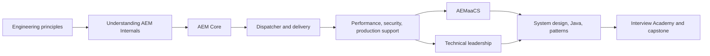

# Product Strategy: Growth Phase (August 2026–July 2027)

> Scope: content product strategy only. This plan does not change the site UI, navigation, brand, or platform architecture.

## 1. Product Vision

By v1.0, the AEM Technical Lead Playbook will be the practical, evidence-led learning product for an AEM engineer progressing to Technical Lead: a reader can understand the platform, make safe production decisions, lead technical reviews, and demonstrate that judgment in interviews.

The differentiator is not a broad AEM reference catalogue. It is a connected learning experience built around request flow, production ownership, decisions, and realistic scenarios. Each substantial chapter should answer four questions: how does it work, what can fail, what trade-off is being made, and how would a Technical Lead explain or govern that decision?

### Product principles

- **AEM-first and production-first:** use the completed request-lifecycle material as the spine; add general engineering only when it improves AEM delivery or Technical Lead judgment.
- **Learn by decision:** pair concepts with a decision, an observable signal, a failure mode, and a review question.
- **Progressive disclosure:** establish AEM Core before delivery controls; establish delivery controls before cloud, leadership, and system design.
- **Interview preparation is an outcome, not a parallel syllabus:** derive questions and scenarios from completed content.
- **Maintainable depth:** prefer fewer reviewed chapters with production stories and labs over many thin topic pages.

## 2. Product Roadmap

| Release                                            | Window            | Product bet                                                                                           | Chapters / assets to complete                                                                                                                | Why now                                                                                                                                      |
| -------------------------------------------------- | ----------------- | ----------------------------------------------------------------------------------------------------- | -------------------------------------------------------------------------------------------------------------------------------------------- | -------------------------------------------------------------------------------------------------------------------------------------------- |
| **v0.5 — AEM Delivery Foundations**                | Aug–Oct 2026      | Turn the existing request-flow knowledge into practical AEM application and edge-delivery competence. | AEM Core; Dispatcher; delivery checklists; two production stories; two labs; a first interview question bank.                                | AEM Core is the missing prerequisite. Dispatcher converts the already-published internals chapter into immediately usable delivery judgment. |
| **v0.6 — Operate Securely and Perform Reliably**   | Nov 2026–Jan 2027 | Make readers capable of measuring, securing, and supporting production AEM.                           | Performance; Security; Production Support; incident and release checklists; three production stories; three labs.                            | This is the highest Technical Lead readiness increment and prepares safe cloud adoption.                                                     |
| **v0.7 — Cloud Delivery and Technical Leadership** | Feb–Apr 2027      | Move from individual system competence to accountable cloud delivery and team-level execution.        | AEM as a Cloud Service; Technical Leadership; Architecture Review checklist; case-study format; two decision records/case studies; two labs. | Cloud operating boundaries and leadership practices depend on reliable delivery, security, and support foundations.                          |
| **v0.8 — Architecture and Interview Academy**      | May–Jul 2027      | Synthesize platform and leadership knowledge into architectural reasoning and interview practice.     | System Design; focused Enterprise Java; Design Patterns; Interview Guide; curated Reference; four scenario cases; mock-interview bank.       | These are synthesis topics. Their quality depends on completed concrete AEM and operational material.                                        |
| **v1.0 — Complete AEM Technical Lead Playbook**    | Aug 2027          | Publish a coherent, reviewed, role-based curriculum with evidence of readiness.                       | Editorial consolidation, gap closure, learning-path completion criteria, release-quality audit, contributor maintenance model.               | v1.0 is a quality and completeness threshold—not a feature bundle.                                                                           |

### Deferred beyond v1.0

Company-specific tracks (Adobe, Microsoft, Amazon, Salesforce, Atlassian), broad distributed-systems/CAP coverage, and a generic Java interview catalogue should be postponed. They risk diluting the AEM Technical Lead promise before the core curriculum has depth. Add them only after demand evidence and named maintainers exist.

## 3. Release Plan

| Release  | Mission                                                                                  | Audience                                                                   | Learning objectives                                                                                                                                           | Reading time           | Difficulty   | Prerequisites                                                      | Production stories required                                                                                           | Interview topics                                                                                                    | Hands-on labs                                                                                   | Engineering Mentor AI opportunities                                                                             |
| -------- | ---------------------------------------------------------------------------------------- | -------------------------------------------------------------------------- | ------------------------------------------------------------------------------------------------------------------------------------------------------------- | ---------------------- | ------------ | ------------------------------------------------------------------ | --------------------------------------------------------------------------------------------------------------------- | ------------------------------------------------------------------------------------------------------------------- | ----------------------------------------------------------------------------------------------- | --------------------------------------------------------------------------------------------------------------- |
| **v0.5** | Build confident AEM delivery judgment from repository to cached response.                | AEM developers; senior developers new to ownership.                        | Model content and application structure; explain author/publish and request paths; configure and reason about caching; diagnose cache or resolution failures. | 6–8 hours              | Intermediate | Introduction, Engineering Principles, Understanding AEM Internals. | 2: cache invalidation regression; incorrect resource/script resolution.                                               | AEM architecture, Sling resolution, JCR/content modelling, Dispatcher cache rules, debugging approach.              | 2: trace a request end-to-end; design and validate a cache invalidation plan.                   | Request-flow tutor; configuration-review coach; Socratic troubleshooting simulation.                            |
| **v0.6** | Establish reliable, secure production ownership.                                         | Senior AEM developers; new Technical Leads; operations-adjacent engineers. | Define performance evidence; select cache and observability controls; assess delivery security risks; lead incident triage and follow-up.                     | 8–10 hours             | Advanced     | v0.5.                                                              | 3: latency regression; access/secrets exposure; incident mitigation and learning review.                              | Performance diagnosis, secure defaults, incident leadership, SLO/error-budget reasoning, risk trade-offs.           | 3: construct a benchmark plan; conduct a security review; run a tabletop incident.              | Performance investigation coach; threat-model prompts; incident commander simulator and post-incident reviewer. |
| **v0.7** | Lead cloud delivery, technical decisions, and teams responsibly.                         | Technical Lead candidates; existing leads moving to AEMaaCS.               | Explain responsibility boundaries; plan a safe release; run an architecture review; delegate, escalate, and communicate technical risk.                       | 7–9 hours              | Advanced     | v0.5–v0.6; production-support literacy.                            | 2: cloud release/rollback decision; multi-team architectural trade-off.                                               | AEMaaCS operating model, release governance, architecture reviews, stakeholder communication, leadership scenarios. | 2: evaluate a cloud release plan; facilitate an architecture-review simulation.                 | Architecture-review facilitator; decision-record critique; role-play for escalation and stakeholder updates.    |
| **v0.8** | Convert experience into architecture and interview performance.                          | Senior engineers, Technical Lead candidates, future solution architects.   | Frame requirements; compare architectures; use Java/pattern decisions in context; communicate a structured interview answer.                                  | 9–12 hours             | Advanced     | v0.5–v0.7; working Java knowledge.                                 | 4: integration failure, consistency/cache trade-off, pattern reversal, architecture decision under delivery pressure. | System design, Java/JVM/concurrency/collections, patterns/anti-patterns, integration, leadership and AEM scenarios. | 3: write an ADR from a case; design a content-delivery system; complete a timed mock interview. | Adaptive mock interviewer; answer rubric/scoring; design-review adversary; personalised gap-based study plan.   |
| **v1.0** | Deliver a trusted complete learning journey and sustainable open-source content product. | All defined roles; contributors and mentors.                               | Navigate role tracks; demonstrate outcome evidence; apply the playbook to a realistic capstone; contribute safely.                                            | 30–40 cumulative hours | Progressive  | All core releases, according to track.                             | At least 11 reviewed, anonymised stories across v0.5–v0.8.                                                            | Curated cross-domain question bank with role and competency tags.                                                   | Capstone: propose, review, operate, and explain an AEM delivery decision.                       | Competency map, capstone feedback, contributor onboarding assistant with human review gates.                    |

## 4. Learning Journey

| Track                     | Intended outcome                                                    | Release sequence              | Evidence of progress                                     |
| ------------------------- | ------------------------------------------------------------------- | ----------------------------- | -------------------------------------------------------- |
| AEM Developer             | Explain and safely change an AEM request path.                      | Principles → Internals → v0.5 | Request trace and cache/invalidation lab.                |
| Senior Developer          | Own reliability, security, and incident decisions.                  | v0.5 → v0.6                   | Performance plan, security review, incident tabletop.    |
| Technical Lead            | Lead delivery and architecture decisions across people and systems. | v0.6 → v0.7 → v0.8            | Facilitated review, ADR, stakeholder decision narrative. |
| Future Solution Architect | Design and defend cross-cutting AEM solution trade-offs.            | v0.7 → v0.8 → v1.0            | Capstone architecture and operational plan.              |

## 5. Content Prioritization Matrix

Scores: 5 = highest. Priority weighs learner value, dependency value, interview value, and feasibility; reach is the final product decision.

| Content area                                    | Learner value | Technical Lead readiness | Interview value | Dependency value | Effort | Priority     | Decision                                                   |
| ----------------------------------------------- | ------------: | -----------------------: | --------------: | ---------------: | -----: | ------------ | ---------------------------------------------------------- |
| AEM Core                                        |             5 |                        4 |               5 |                5 |      M | **P0**       | Build in v0.5.                                             |
| Dispatcher                                      |             5 |                        5 |               5 |                5 |      M | **P0**       | Build in v0.5.                                             |
| Performance                                     |             5 |                        5 |               5 |                4 |      M | **P0**       | Build in v0.6.                                             |
| Security                                        |             5 |                        5 |               5 |                4 |      M | **P0**       | Build in v0.6.                                             |
| Production Support                              |             5 |                        5 |               5 |                4 |      M | **P0**       | Build in v0.6.                                             |
| AEMaaCS                                         |             5 |                        4 |               5 |                4 |      M | **P1**       | Build in v0.7.                                             |
| Technical Leadership                            |             5 |                        5 |               5 |                3 |      M | **P1**       | Build in v0.7.                                             |
| System Design                                   |             5 |                        5 |               5 |                3 |      L | **P1**       | Build in v0.8.                                             |
| Enterprise Java (JVM, concurrency, collections) |             4 |                        4 |               5 |                2 |      L | **P1**       | Focused v0.8 scope.                                        |
| Design Patterns                                 |             3 |                        4 |               4 |                2 |      M | **P2**       | Use AEM/Java cases in v0.8; avoid catalogue treatment.     |
| Interview Guide                                 |             5 |                        4 |               5 |                1 |      M | **P2**       | Publish after source topics, v0.8.                         |
| Case Studies                                    |             5 |                        5 |               5 |                2 |      M | **P1**       | Seed with every release; consolidate v0.8.                 |
| Checklists                                      |             4 |                        5 |               4 |                3 |      S | **P1**       | Release alongside v0.5–v0.7 topics.                        |
| Reference                                       |             2 |                        2 |               2 |                1 |      S | **P3**       | Curate only what completed chapters need.                  |
| Company-specific interview tracks               |             2 |                        1 |               3 |                0 |      L | **Deferred** | Reassess after v1.0.                                       |
| Distributed systems / CAP / messaging           |             3 |                        4 |               4 |                1 |      L | **Deferred** | Add only where an AEM integration case makes it necessary. |

### Repository content audit

| Existing chapter / asset group                  | Product status            | Finding and action                                                                                                                                                                                                                            |
| ----------------------------------------------- | ------------------------- | --------------------------------------------------------------------------------------------------------------------------------------------------------------------------------------------------------------------------------------------- |
| Introduction; Engineering Principles            | Published foundation      | Valuable orientation, but the 15 principle pages overlap in format and repeatedly point forward. Retain; later add a short competency map rather than expanding philosophy pages.                                                             |
| Learning Roadmap                                | Under-specified           | It currently contains TODO audience tracks and lacks prerequisites, time, and proof of completion. Complete it at v1.0 as the canonical learner-facing view of this plan.                                                                     |
| Understanding AEM Internals                     | Published core pillar     | The best-developed content and correct spine. Preserve its request-flow focus; link it bidirectionally with AEM Core, Dispatcher, performance, security, and production support.                                                              |
| AEM Core                                        | Planned                   | Critical missing prerequisite. Its current topic boundary overlaps internals; define it as content model, author/publish, project/application structure, components, workflows, permissions, and delivery conventions—not request resolution. |
| Dispatcher                                      | Planned                   | Some conceptual duplication already exists in Internals (Dispatcher overview, Apache, cache concepts). Make this chapter operational: configuration decisions, invalidation, security, observability, rollout, and incident response.         |
| Performance; Security                           | Planned                   | Both recur as principle-level concepts and in internals. Keep principles as behavior; make these evidence-based operating handbooks with explicit gates and labs.                                                                             |
| AEMaaCS                                         | Planned                   | Needs a clear managed-service responsibility model and a cross-reference to Dispatcher/CDN rather than a generic cloud overview.                                                                                                              |
| Enterprise Java; Design Patterns; System Design | Planned                   | Ordering is currently weak: Java and patterns precede system design in navigation but depend on design context. Retain navigation unchanged; sequence learning as system-design framing first, then focused Java/pattern choices within v0.8. |
| Technical Leadership; Production Support        | Planned                   | These overlap Engineering Principles (ownership, decision-making, mentorship, debugging). Promote them as applied practices: operating cadence, incident command, reviews, delegation, and communication artifacts.                           |
| Checklists                                      | Mixed                     | Root checklists exist, but the docs chapter is only a landing page and the architecture-review checklist still has TODOs. Release topic-specific checklists with the chapters they govern; do not create a disconnected checklist corpus.     |
| Interview Guide; Case Studies                   | Planned                   | The repository reports only one interview-readiness page and no production stories. Make both derivative products of reviewed core chapters; do not build a standalone question dump first.                                                   |
| Reference                                       | Planned                   | Keep deliberately small and source-governed. It is not a primary learning release.                                                                                                                                                            |
| Dashboards, ROADMAP, RELEASES                   | Product metadata conflict | Current release is shown as v0.3 in the index/release dashboard and v0.4 in the engineering dashboard; roadmap milestones conflict with both. Resolve a single source of truth before announcing v0.5.                                        |

## 6. Interview Coverage Matrix

| Competency                                                | Current coverage                                    | Target release   | Evidence format                                                        | Representative employer relevance                                       |
| --------------------------------------------------------- | --------------------------------------------------- | ---------------- | ---------------------------------------------------------------------- | ----------------------------------------------------------------------- |
| AEM request lifecycle, Sling, HTL, JCR                    | Strong: Internals plus one interview-readiness page | Maintain in v0.5 | Explain a request path and diagnose a resolution failure.              | Adobe/AEM specialist roles; enterprise consultancies.                   |
| Components, content modelling, author/publish             | Missing                                             | v0.5             | Scenario question and content-model review.                            | AEM developer and senior developer roles.                               |
| Dispatcher, CDN, caching, Apache                          | Introductory in Internals; no operational depth     | v0.5–v0.6        | Cache decision, invalidation incident, header/cacheability review.     | AEM, platform, and performance roles.                                   |
| Performance and observability                             | Principle-level only                                | v0.6             | Benchmark plan and latency investigation.                              | Senior engineer, lead, Amazon-style operational interviews.             |
| Security, permissions, secrets, supply chain              | Principle-level only                                | v0.6             | Threat/risk review and secure delivery decision.                       | Enterprise, regulated, Salesforce/Microsoft-style roles.                |
| Incident response and production ownership                | Principle-level only                                | v0.6             | Incident-command scenario and post-incident narrative.                 | Technical Lead and platform roles.                                      |
| AEMaaCS and release model                                 | Missing                                             | v0.7             | Release/rollback and responsibility-boundary scenario.                 | Current AEM roles.                                                      |
| Leadership, reviews, mentoring, stakeholder communication | Principle-level only                                | v0.7             | Architecture review and behavioural situation with technical evidence. | Lead roles across all target employers.                                 |
| Java/JVM/concurrency/collections                          | Missing                                             | v0.8             | Timed reasoning questions tied to AEM services and performance.        | General senior Java roles.                                              |
| System design, integrations, resilience, caching          | Missing                                             | v0.8             | Whiteboard/ADR-style design exercise.                                  | Amazon, Microsoft, Salesforce, Atlassian-style architecture interviews. |
| Company-specific frameworks                               | Missing by design                                   | Post-v1.0        | Only a curated overlay if verified demand and maintainers exist.       | Avoid unmaintainable employer trivia.                                   |

## 7. Engineering Mentor AI Integration Plan

Engineering Mentor AI should be introduced as an opt-in learning layer, not a source of authority. It must cite the relevant playbook page, state uncertainty, avoid handling sensitive production data, and route recommendations through human review for security, release, or architecture decisions.

| Stage                      | Capabilities                                                                            | Guardrails                                                                                                            | Success evidence                                                                |
| -------------------------- | --------------------------------------------------------------------------------------- | --------------------------------------------------------------------------------------------------------------------- | ------------------------------------------------------------------------------- |
| **v0.5 pilot**             | Guided request trace; Dispatcher troubleshooting dialogue; lab hints.                   | Retrieval limited to published, versioned playbook content; no configuration generated as production-ready.           | Learners complete labs with fewer abandoned attempts; helpfulness rating ≥4/5.  |
| **v0.6 practice**          | Performance hypothesis coach; threat-model prompts; incident tabletop simulation.       | Require stated assumptions and evidence; anonymised fictional scenarios only; display escalation guidance.            | Scenario completion and rubric improvement between first and second attempt.    |
| **v0.7 leadership**        | ADR critique; architecture-review facilitation; communication role-play.                | AI challenges reasoning rather than selecting a decision; human-approved rubric and examples.                         | Review-quality rubric and learner confidence improve.                           |
| **v0.8 interview academy** | Adaptive mock interview; answer feedback against competency tags; gap-based study plan. | Do not claim employer-specific inside knowledge; expose rubric and source links; no hiring prediction.                | Mock-interview repeat rate, skill-gap closure, and learner-reported relevance.  |
| **v1.0 scale**             | Cross-track competency map and capstone feedback.                                       | Editorial governance, evaluation dataset, feedback/appeal path, privacy statement, and periodic hallucination review. | Reliable citation rate, low unsafe-answer rate, and human editorial acceptance. |

## 8. Success Metrics

| Dimension                                                                         |          v0.5 target |      v0.8 target |      v1.0 target |
| --------------------------------------------------------------------------------- | -------------------: | ---------------: | ---------------: |
| Reviewed substantive chapters released                                            |                    2 |               10 |              12+ |
| Production stories, anonymised and reviewed                                       |                    2 |               11 |              12+ |
| Hands-on labs with expected outcomes                                              |                    2 |               10 |              12+ |
| Interview prompts tagged to competencies                                          |                   20 |              100 |             140+ |
| Completion of a release learning path                                             | Baseline established | ≥20% of starters | ≥30% of starters |
| Learner usefulness rating                                                         |               ≥4.2/5 |           ≥4.3/5 |           ≥4.4/5 |
| Chapters with prerequisites, objectives, time, difficulty, story and lab metadata |          100% of new |      100% of new |     100% of core |
| Broken or stale cross-references in release audit                                 |                    0 |                0 |                0 |
| Active repeat contributors / editorial reviewers                                  | Baseline established |                6 |               10 |

Measure acquisition and engagement with privacy-respecting aggregate analytics, GitHub signals, lab completion self-reports, issue/discussion feedback, and periodic learner interviews. Metrics should inform scope; they must not encourage shallow page production.

## 9. Risks

| Risk                                                | Effect                                    | Mitigation                                                                                                                   |
| --------------------------------------------------- | ----------------------------------------- | ---------------------------------------------------------------------------------------------------------------------------- |
| Broad scope creates thin chapters.                  | Weakens trust and delays v1.0.            | Enforce release acceptance criteria: objectives, prerequisites, story, lab, questions, references, editorial review.         |
| Product drift into generic Java or employer trivia. | Loses AEM Technical Lead differentiation. | Use the prioritization matrix; require an AEM delivery or leadership decision for inclusion.                                 |
| Confidential production stories cannot be sourced.  | Cases become abstract.                    | Use anonymised composites with stated constraints and reviewer validation; never publish client-identifying detail.          |
| Adobe platform guidance becomes stale.              | Unsafe or misleading advice.              | Source authority policy, version/date metadata, named maintainer, and six-month review cadence for AEMaaCS/security content. |
| Metadata and dashboard version conflicts persist.   | Confuses learners and contributors.       | Designate one release record as canonical and validate version references in release checks.                                 |
| AI output is over-trusted.                          | Unsafe production or interview guidance.  | Citation-first UX, scenario boundaries, refusal/escalation rules, evaluation before expansion, human governance.             |
| Open-source reviewer capacity is insufficient.      | Release schedule slips or quality drops.  | Maintain a small scope, recruit domain reviewers per release, publish contributor briefs and review rubrics.                 |

## 10. Recommendation for v1.0

Ship v1.0 when the playbook can credibly support one complete Technical Lead journey, not when every possible topic exists. The v1.0 release gate should require:

- the four release learning paths completed and cross-linked without changing navigation;
- AEM Core, Dispatcher, Performance, Security, Production Support, AEMaaCS, Technical Leadership, and System Design released at substantive depth;
- a focused—not encyclopaedic—Enterprise Java and Design Patterns module;
- at least 12 reviewed production stories, 12 labs, and 140 competency-tagged interview prompts;
- all core pages carrying consistent learning metadata and no TODO placeholders in learner-facing core material;
- a reconciled release/version source of truth;
- editorial owners and a documented freshness policy for high-risk AEM, security, and cloud guidance;
- an Engineering Mentor AI beta only if its citation, safety, privacy, and human-review gates pass.

Do not make company-specific interview academies, generic distributed-systems theory, or broad reference accumulation v1.0 blockers. The durable v1.0 promise is: _an AEM engineer can progress from platform understanding to production-ready Technical Lead judgment, and show that judgment in a real interview or review._
