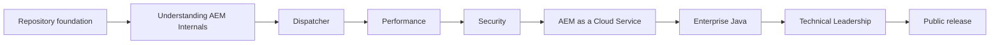

# Release Dashboard

## Current release

- Version: v0.3.0
- Focus: Understanding AEM Internals
- Status: Released

## Completed chapters

- [x] Engineering Principles
- [x] Learning Roadmap
- [x] Understanding AEM Internals
- [x] Repository foundation, governance, and quality gates

## In progress

### Planned next releases

- v0.4 — Dispatcher
- v0.5 — Performance
- v0.6 — Security
- v0.7 — AEM as a Cloud Service
- v0.8 — Enterprise Java
- v0.9 — Technical Leadership
- v1.0 — Public release

## Learning progress

The playbook is structured to help readers move from:

1. engineering judgment and platform fundamentals
2. AEM internals and delivery behavior
3. production ownership and resilience
4. system design and architectural leadership

## Repository statistics

- Documentation pages: published and curated in the `docs/` tree
- Governance and community controls: maintained in the repository root
- Quality gates: formatting, markdown linting, spell checking, and link validation
- Publication model: GitHub Pages with Material for MkDocs

## Roadmap progress

## Recommended next reading

- [Engineering Dashboard](engineering-dashboard.md)
- [Introduction](00-introduction/README.md)
- [Learning Roadmap](01-learning-roadmap/README.md)
- [AEM Engineering overview](20-understanding-aem-internals/README.md)
- [Engineering Principles](00-engineering-principles/README.md)

## Contribution signal

This project is intentionally incremental. New chapters are added when their underlying content can be reviewed, linked, and maintained with the same quality bar as the rest of the handbook.
